# SGA vs PGA : comprendre la mémoire d'Oracle

### 1. Le modèle de Von Neumann

Le CPU ne traite que ce qui est présent dans la RAM. Les données vivent de façon permanente sur le disque, mais toute opération oblige à les ramener en mémoire avant de les manipuler. Chaque instruction passe par trois étapes :

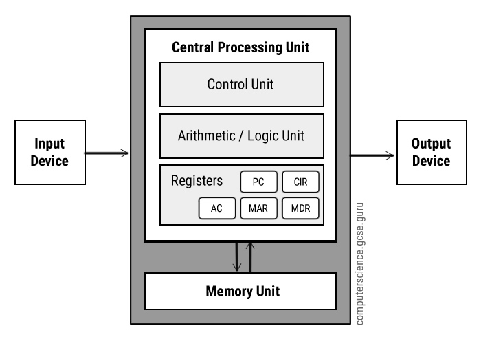

1. *Schéma : le modèle de Von Neumann (CPU, mémoire et bus).*
2. **Fetch (récupération)** : le *Program Counter* (PC) détient l'adresse mémoire de la prochaine instruction, recopiée dans le *Memory Address Register* (MAR). L'adresse part par le bus d'adresses pendant que l'unité de contrôle (*Control Unit*, CU) envoie un signal de lecture. L'instruction revient par le bus de données dans le *Memory Data Register* (MDR), puis est copiée dans le *Current Instruction Register* (CIR). Le PC s'incrémente pour pointer sur l'instruction suivante.
3. **Decode (interprétation)** : la CU analyse l'instruction contenue dans le CIR et la découpe en *opcode* (l'opération : ADD, LOAD...) et *operand* (la donnée ou l'adresse à utiliser). Elle prépare les chemins de données et les signaux de contrôle nécessaires.
4. **Execute (action)** : l'**ALU** (*Arithmetic Logic Unit*) exécute l'opération (calcul arithmétique ou logique). Le résultat est conservé dans un registre (comme l'accumulateur) ou réécrit en mémoire. Le processeur repart immédiatement à l'étape Fetch.

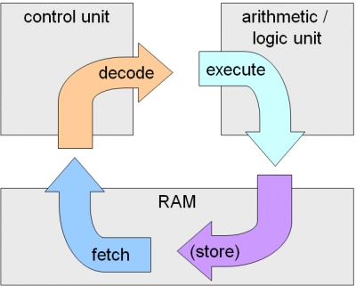

*Schéma : le cycle d'instruction (fetch – decode – execute) d'une CPU Von Neumann.*

### 2. La pyramide mémoire

Du plus rapide (en haut) au plus lent (en bas). Plus on monte, plus c'est rapide, petit et cher :

| Niveau    | Latence indicative |
| --------- | ------------------ |
| Registres | 0,3 ns             |
| Cache L1  | 1 ns               |
| Cache L2  | 4 ns               |
| Cache L3  | 15 ns              |
| RAM       | 80 ns              |
| SSD       | 50 µs             |
| HDD       | 5 ms               |

Plus on se rapproche de l'ALU au sein du processeur, plus l'accès à la mémoire est ultra-rapide. C'est exactement cette hiérarchie que les bases de données (SGA, PGA) reproduisent à leur échelle.


### 3. Processus vs thread ; foreground vs background

Pour bien comprendre le fonctionnement d'un système d'exploitation, il faut distinguer la manière dont les programmes s'exécutent (Processus vs Thread) et la manière dont ils interagissent avec l'utilisateur (Foreground vs Background).

#### 1. Processus vs Thread : les unités d'exécution

**Qu'est-ce qu'un processus ?** Un programme est un simple fichier inerte stocké sur le disque (par exemple `chrome.exe`). Un **processus** est ce programme *en cours d'exécution* : c'est l'instance vivante que l'OS crée quand on lance le programme. Pour la faire tourner, l'OS lui attribue :

* un **espace d'adressage virtuel** qui lui est propre (code, données, Heap, Stack) ;
* des **ressources** : fichiers ouverts, connexions réseau, etc. ;
* un **identifiant unique** (PID) et un état (en cours d'exécution, en attente, terminé) ;
* au moins un **thread** : le fil qui exécute réellement les instructions.

Un même programme peut donner plusieurs processus : ouvrir deux fenêtres d'un éditeur peut créer deux processus indépendants du même programme.

**Qu'est-ce qu'un thread ?** Un **thread** (fil d'exécution) est l'unité qui exécute réellement les instructions à l'intérieur d'un processus. Un processus contient au moins un thread, et peut en contenir plusieurs pour faire plusieurs choses en même temps.

La différence fondamentale entre les deux réside dans le partage des ressources et de la mémoire (la Heap, la Stack).

* **Un Processus (lourd)** : une application en cours d'exécution. Chaque processus possède sa propre mémoire virtuelle isolée (sa propre Stack, son propre Heap) et ses propres ressources.
  * Exemple : Ouvrir le navigateur Chrome et le lecteur VLC lance deux processus distincts. Si VLC plante, Chrome continue de fonctionner sans problème car ils sont totalement étanches.
* **Un Thread / Fil d'exécution (léger)** : une sous-tâche qui s'exécute à l'intérieur d'un processus. Tous les threads d'un même processus partagent le même espace mémoire (le même Heap, les mêmes variables globales), mais chacun possède sa propre Stack : la zone mémoire où sont empilés les appels de fonctions en cours (variables locales, paramètres, adresses de retour). Chaque thread exécute sa propre suite d'appels, il lui faut donc sa propre pile pour ne pas mélanger ses données avec celles des autres.
  * Exemple : Dans votre navigateur Chrome (un processus), un thread gère l'affichage de la page web, un autre télécharge un fichier en arrière-plan, et un troisième écoute les clics de votre souris. Si un thread corrompt la mémoire partagée (le Heap), c'est tout le processus qui peut planter.

| Caractéristique       | Processus                                                         | Thread                                                     |
| ---------------------- | ----------------------------------------------------------------- | ---------------------------------------------------------- |
| Mémoire (Heap/Code)   | Totalement isolée pour chaque processus.                         | Partagée entre tous les threads d'un processus.           |
| Mémoire (Stack)       | Chaque processus a la sienne.                                     | Chaque thread a sa propre Stack dédiée.                  |
| Coût de création     | Élevé (création de la mémoire virtuelle, chargement du code). | Faible (utilise la mémoire déjà allouée au processus). |
| Changement de contexte | Lent (nécessite de vider le TLB ou de changer d'ASID).           | Très rapide (pas de changement de mémoire virtuelle).    |
| Impact en cas de crash | Si un processus plante, les autres survivent.                     | Si un thread plante gravement, tout le processus meurt.    |

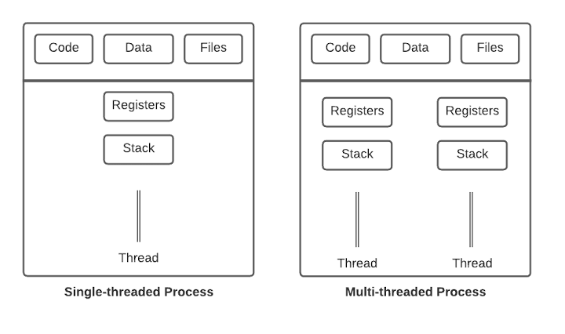

*Schéma : mémoire isolée des processus vs mémoire partagée des threads.*

#### 2. Foreground vs Background : l'interaction utilisateur

Cette distinction concerne la priorité d'affichage et l'allocation des ressources par rapport à l'utilisateur.

* **Foreground (premier plan)** : le processus ou le thread avec lequel l'utilisateur interagit directement en ce moment précis.
  * Caractéristiques : il possède le « focus » de l'écran, reçoit les entrées clavier et souris, et l'OS lui accorde une priorité maximale sur le CPU pour une fluidité parfaite.
  * Exemple : le traitement de texte sur lequel vous tapez.
* **Background (arrière-plan)** : un processus ou thread qui s'exécute de manière invisible, sans interface graphique active.
  * Caractéristiques : priorité plus basse ; le système peut réduire ses ressources si le premier plan en a besoin.
  * Exemple : un antivirus qui analyse vos fichiers pendant que vous jouez.

### 4. L'espace d'adressage virtuel

Chaque processus possède **son propre espace de mémoire virtuelle**, structuré en plusieurs segments bien distincts : `code`, `data`, `heap` (le tas) et `stack` (la pile). Le *heap* et la *stack* sont les deux zones qui nous intéresseront pour comprendre le partage mémoire et la PGA.

| Segment | Rôle | Contenu | Taille / gestion |
| ----------- | ------------------------------------------------------------------------------------ | ---------------------------------------------------------------------------------------------- | ---------------------------------------------------------------------------------------------------------------------------------------------------- |
| `code` | Stocke les instructions du programme à exécuter. | Le code machine du programme compilé. | Fixe, déterminée au chargement du programme. En lecture seule (et exécutable) pour éviter qu'il soit modifié par erreur. |
| `data` | Stocke les données qui existent pendant toute la durée du programme. | Variables globales et statiques (initialisées ou non). | Fixe, déterminée à la compilation. |
| `heap` | Stocke les données dont la taille ou la durée de vie n'est pas connue à l'avance. | Objets et structures créés dynamiquement (`malloc`, `new`, listes, tableaux dynamiques). | Dynamique : grandit à la demande. Gestion manuelle (`free`) ou par un garbage collector. **Partagé entre les threads du processus.** |
| `stack`  | Suit l'exécution des fonctions en cours. | Variables locales, paramètres et adresses de retour de chaque appel de fonction. | Gérée automatiquement : un bloc est empilé à chaque appel de fonction et dépilé à son retour. Taille limitée.**Une stack par thread.** |

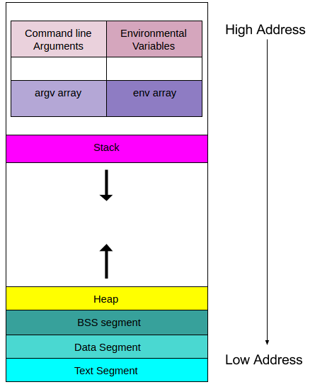

*Schéma : la structure de l'espace d'adressage virtuel d'un processus (code, data, heap, stack).*

### 5. La pagination et le TLB

Pour traduire les adresses virtuelles de chaque processus en adresses physiques dans la RAM, la **MMU** (*Memory Management Unit*) combine deux mécanismes :

**La pagination : le découpage de la mémoire.**

*Le problème.* Chaque processus croit disposer de toute la mémoire pour lui seul : c'est la mémoire virtuelle. Mais la vraie mémoire (la RAM) est partagée entre tous les processus, et il faut donc faire le lien entre les deux. Gérer ce lien octet par octet serait beaucoup trop lent : avec des milliards d'octets, il faudrait une entrée de suivi par adresse, soit une table gigantesque.

*La solution.* L'OS découpe la mémoire en blocs de taille fixe (généralement 4 Ko) et ne gère plus qu'une entrée par bloc au lieu de 4096 :

* Les **pages** : les blocs de la mémoire **virtuelle** du processus (4 Ko chacun).
* Les **cadres (frames)** : les blocs de la mémoire **physique** (la RAM), de la même taille (4 Ko). Un cadre peut accueillir exactement une page.
* La **table des pages** : le « dictionnaire » du processus, stocké en RAM, qui indique dans quel cadre physique se trouve chaque page virtuelle.

*Comment une adresse est traduite.* Une adresse virtuelle est découpée en deux parties :

| Partie | Rôle |
| ---------------------------- | --------------------------------------------------------------------------------- |
| **Numéro de page** | Sert à chercher dans la table des pages le numéro du cadre correspondant. |
| **Décalage (offset)** | Position de l'octet à l'intérieur de la page. Il reste identique dans le cadre. |

L'adresse physique s'obtient en combinant le **numéro de cadre** (trouvé dans la table) et le **décalage** (inchangé).

*Exemple (pages de 4 Ko).* Le processus accède à l'adresse virtuelle `8200`.

1. `8200 ÷ 4096 = 2` reste `8` : c'est la **page 2**, **décalage 8**.
2. La table des pages indique : page 2 → **cadre 5**.
3. Adresse physique = `5 × 4096 + 8 = 20488`.

*Les avantages et pourquoi ils existent.*

* **Pas de fragmentation externe.**
  *Le problème sans pagination :* si l'OS donne à chaque processus un bloc contigu de RAM de taille variable, la RAM se retrouve vite parsemée de petits trous libres entre les blocs. On peut avoir 100 Mo libres au total, mais éparpillés en trous de 10 Mo : impossible de placer un processus qui demande 50 Mo d'un seul tenant.
  *Pourquoi la pagination règle ça :* tous les cadres ont la même taille (4 Ko) et chaque page occupe exactement un cadre. Un cadre libre convient donc toujours à n'importe quelle page, où qu'il se trouve. Un processus de 50 Mo est simplement réparti sur 12 800 cadres quelconques, contigus ou non. C'est la table des pages qui retrouve où est chaque morceau, donc la contiguïté physique n'est plus nécessaire.
* **Isolation.**
  *Pourquoi ça marche :* un processus n'utilise que des adresses virtuelles, et seule sa propre table des pages sait les traduire en adresses physiques. Il n'existe aucune adresse virtuelle qui mène vers les cadres d'un autre processus, car ces cadres ne figurent tout simplement pas dans sa table. Il ne peut pas les viser, même par erreur. Comme c'est la MMU (matériel) qui fait la traduction, un processus ne peut pas contourner cette protection. Chaque entrée de la table contient en plus des droits (lecture, écriture, exécution) : écrire dans une page en lecture seule, comme le code, déclenche une erreur.
* **Table plus petite et gestion plus rapide.**
  *Pourquoi :* la table des pages contient une entrée par page et non par octet. Avec des pages de 4 Ko, il y a 4096 fois moins d'entrées, donc une table 4096 fois plus petite. Les opérations se font aussi à l'échelle de la page : pour protéger, déplacer sur le disque (swap) ou libérer 1 Mo, l'OS modifie 256 entrées au lieu d'un million d'octets. La mémoire consommée par la table et le temps de gestion restent ainsi raisonnables.

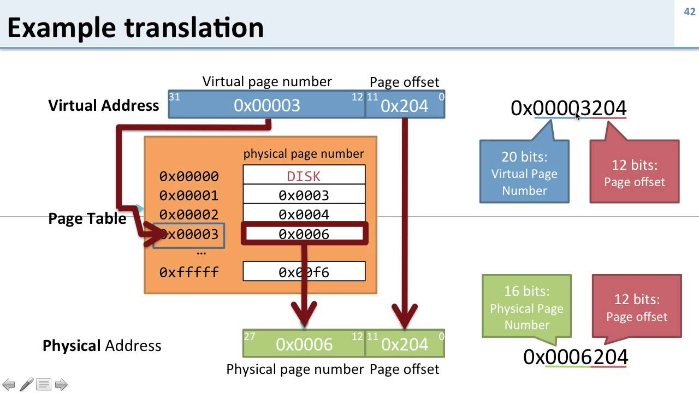

*Schéma : la pagination (pages virtuelles vers cadres physiques).*

Le problème : sans accélérateur, chaque accès de l'ALU exigerait **deux** accès à la RAM (un pour la table des pages, un pour la donnée) — le débit de l'ordinateur serait divisé par deux.

**Le TLB : l'accélérateur.** Le *Translation Lookaside Buffer* est une petite mémoire cache ultra-rapide intégrée directement à la MMU, proche de l'ALU. Il conserve les traductions d'adresses les plus récentes pour éviter de retraverser la table des pages à chaque accès.

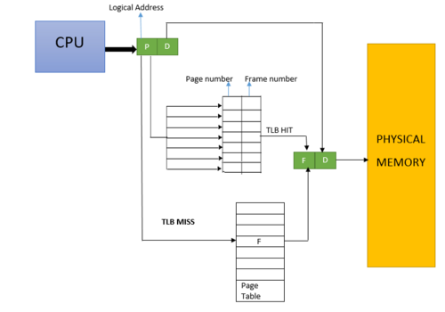

*Schéma : le TLB, cache de traduction d'adresses de la MMU.*

Le cycle complet de traduction :

Chaque fois qu'un programme lit ou écrit en mémoire, le processeur doit traduire l'adresse virtuelle en adresse physique. Voici les étapes.

**Étape 1 : le processeur demande une adresse virtuelle.**
Lors d'une instruction (`lire la variable x`, par exemple), le processeur (l'ALU) fournit à la MMU l'adresse virtuelle du processus. La MMU la découpe en *numéro de page* et *décalage*.

**Étape 2 : la MMU consulte d'abord le TLB.**
Le **TLB** (*Translation Lookaside Buffer*) est un petit cache intégré à la MMU. Il garde en mémoire les traductions récentes (numéro de page → numéro de cadre). Il est très rapide (quelques cycles d'horloge) car il est situé dans le processeur, alors que la table des pages est stockée en RAM, beaucoup plus lente. Deux cas sont possibles :

* **TLB Hit (succès)** : la traduction de cette page est déjà dans le TLB. La MMU obtient immédiatement le numéro de cadre, sans aucun accès à la table des pages en RAM. C'est le cas le plus fréquent, car les programmes réutilisent souvent les mêmes pages (boucles, variables proches).
* **TLB Miss (échec)** : la traduction n'est pas dans le TLB. Il faut alors passer à l'étape 3.

**Étape 3 (uniquement en cas de miss) : lecture de la table des pages.**
La MMU va lire la table des pages du processus, stockée en RAM, pour trouver le numéro de cadre correspondant à la page. C'est lent, car cela coûte un accès mémoire supplémentaire (voire plusieurs, si la table est organisée en plusieurs niveaux). La MMU **charge ensuite cette traduction dans le TLB**, pour que les prochains accès à la même page soient des hits.

**Étape 4 : construction de l'adresse physique et accès à la RAM.**
Que la traduction vienne du TLB ou de la table des pages, la MMU dispose maintenant du numéro de cadre. Elle le combine avec le décalage (inchangé) pour former l'**adresse physique**, puis accède à la RAM réelle pour lire ou écrire la donnée.

**Résumé :**

| Cas      | Chemin                                                                                      | Coût                                                |
| -------- | ------------------------------------------------------------------------------------------- | ---------------------------------------------------- |
| TLB Hit  | TLB → adresse physique → RAM                                                              | 1 accès RAM (celui de la donnée)                   |
| TLB Miss | TLB (échec) → table des pages en RAM → chargement dans le TLB → adresse physique → RAM | 2 accès RAM ou plus (table des pages, puis donnée) |

Le TLB est donc ce qui rend la pagination utilisable en pratique : sans lui, chaque accès mémoire coûterait au moins deux accès RAM.

### 6. La mémoire partagée : le fondement du SGA

Le système d'exploitation connaît deux grandes familles de mémoire :

* La mémoire **privée** : chaque processus reçoit son propre espace d'adressage ; ses pages ne sont visibles par aucun autre processus.
* La mémoire **partagée** (inter-processus) : plusieurs processus peuvent mapper **les mêmes pages physiques** dans leurs espaces d'adressage respectifs (*mmap*, segments de mémoire partagée IPC, etc.). On écrit d'un côté, on lit de l'autre : c'est le mécanisme d'échange inter-processus le plus rapide qui existe.

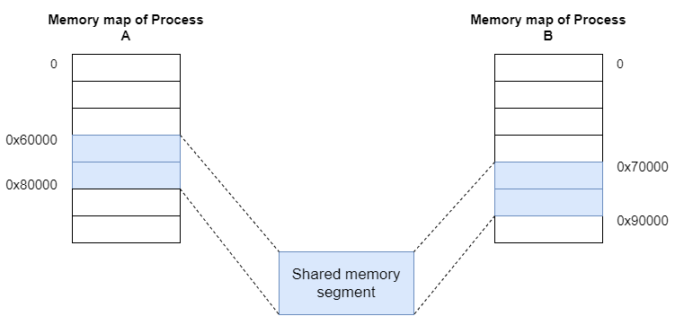

*Schéma : deux processus partagent les mêmes pages physiques (mémoire partagée IPC).*

**À retenir :** deux types de mémoire à l'échelle de l'OS — privée (`heap`) et partagée (`shmem`). C'est le fondement de tout le reste : **la SGA est une mémoire partagée, la PGA est une mémoire privée.** La SGA n'est, en somme, qu'une grosse zone de mémoire partagée de l'OS, mise en commun par tous les processus de l'instance.

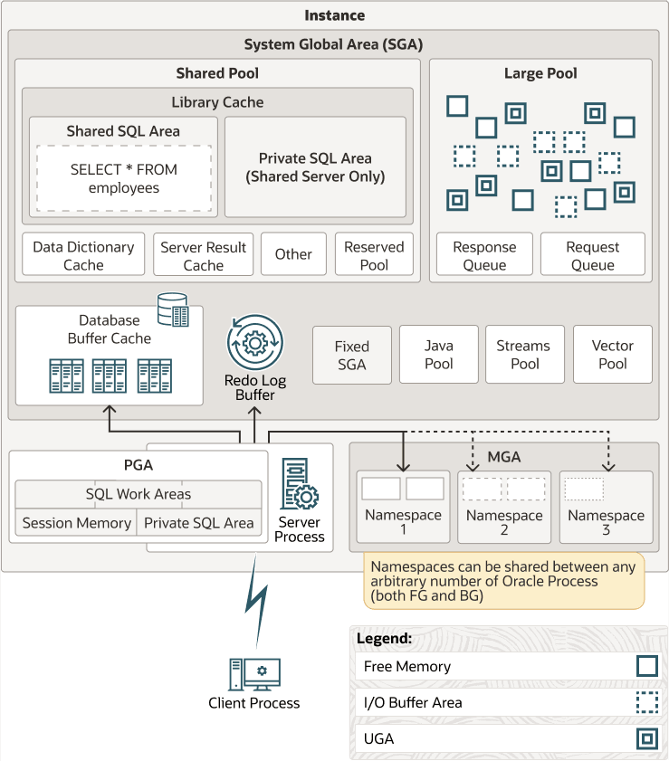

*Schéma : le segment de mémoire partagée que constitue la SGA.*

**La mémoire partagée a un prix : le changement de contexte et le TLB.** Lorsque le processeur arrête le processus A pour exécuter le processus B (context switch), le TLB pose un problème de sécurité et de logique : la page 1 du processus A ne correspond pas au même cadre physique que la page 1 du processus B. Si rien n'était fait, B utiliserait par erreur les traductions de A restées dans le TLB (bugs ou failles de sécurité massives). Deux solutions existent :

#### Méthode 1 : le vidage complet du TLB (TLB flushing)

* **L'action :** dès le changement de processus, l'OS envoie un signal matériel pour effacer entièrement le TLB.
* **L'impact :** le TLB repart à zéro ; les premiers accès mémoire du processus B provoquent tous des TLB Miss, et la MMU doit recalculer chaque traduction via la table des pages (en RAM).
* **Le coût :** un léger ralentissement à chaque changement de processus (coût de « rechargement » ou de warm-up du TLB).

#### Méthode 2 : le marquage ASID (Address Space Identifier)

* **L'action :** chaque ligne du TLB porte une étiquette (un badge) : l'ASID, propre à chaque processus (par exemple A = ASID 1, B = ASID 2).
* **Le fonctionnement :** lorsque le processus B s'exécute, la MMU ne retient que les lignes du TLB qui correspondent à la page demandée **et** qui portent l'ASID du processus B.
* **L'avantage :** plus besoin de vider le TLB lors d'un changement de contexte. Les traductions de A restent sagement dans le cache et sont immédiatement réutilisables si le processeur revient à A.

## 2. Bases : processus et instance

> **Question :** qui travaille, et dans quel cadre ?

### 7. Instance vs base

La règle d'or à retenir : **l'instance s'exécute en mémoire, la base de données vit sur le disque.**

```
┌────────────────────────────────────────────────────────┐
│ INSTANCE (Éphémère - S'arrête et démarre)              │
│   ┌──────────────────────────┐   ┌───────────────────┐ │
│   │ SGA (Mémoire partagée)   │   │ Processus Arrière │ │
│   └──────────────────────────┘   └───────────────────┘ │
└───────────────────────────┬────────────────────────────┘
                            │ (Se connecte à...)
                            ▼
┌────────────────────────────────────────────────────────┐
│ BASE DE DONNÉES (Durable - Reste sur le disque)        │
│  [Fichiers de données]  [Fichiers de contrôle]  [...]  │
└────────────────────────────────────────────────────────┘
```

#### L'instance (éphémère)

L'instance n'est qu'un ensemble de structures logicielles en mémoire vive (RAM). Si vous éteignez le serveur, l'instance disparaît. Elle est composée de deux éléments :

* **La SGA (Shared Global Area)** : une immense zone de RAM allouée par le système. Elle contient les caches (blocs de données lus depuis le disque, code SQL partagé...) pour que l'ALU et le CPU y accèdent à toute vitesse.
* **Les PGA processus d'arrière-plan (background processes)** : des processus/threads spécifiques (DBWn, LGWR, PMON, SMON...) qui gèrent l'écriture sur disque, la maintenance et la sécurité de la base.

#### La base de données (durable)

La base de données est l'ensemble des fichiers physiques stockés de manière permanente sur vos disques durs ou SSD. Même si l'instance est arrêtée, la base de données reste intacte. Elle comprend principalement :

* **Datafiles (fichiers de données)** : où sont stockées vos tables et vos index.
* **Control Files (fichiers de contrôle)** : les fichiers qui décrivent la structure physique de la base (emplacement des autres fichiers, état actuel).
* **Redo Log Files (fichiers de journalisation)** : les fichiers qui enregistrent toutes les modifications en temps réel pour pouvoir réparer la base en cas de panne.

#### 2. Le mécanisme de STARTUP : NOMOUNT -> MOUNT -> OPEN

Pour démarrer une base de données, l'administrateur tape la commande `STARTUP`. Le système passe alors par trois étapes successives et logiques pour lier l'instance à la base.

##### Étape 1 : le mode NOMOUNT (création de l'instance)

* Ce qui se passe : le système lit le fichier de configuration (`init.ora` ou `SPFILE`) pour savoir combien de RAM allouer.
* Résultat : l'instance est créée — la SGA est allouée en RAM et les processus d'arrière-plan démarrent.
* Lien avec le disque : aucun fichier de la base n'est ouvert ni vérifié ; le système ne sait pas encore où se trouvent vos données.
* Utilité : créer une base à partir de zéro, ou recréer un fichier de contrôle perdu.

##### Étape 2 : le mode MOUNT (lien entre l'instance et la base)

* Ce qui se passe : l'instance cherche et ouvre les fichiers de contrôle (Control Files), les lit et sait exactement où se trouvent les Datafiles et les Redo Logs.
* Résultat : l'instance est liée à sa base de données.
* Lien avec le disque : l'instance connaît l'emplacement de tous les fichiers, mais les données ne sont pas encore accessibles ; les datafiles restent fermés et verrouillés.
* Utilité : maintenance lourde (renommer un datafile, activer l'archivage des logs, restaurer une sauvegarde).

##### Étape 3 : le mode OPEN (ouverture aux utilisateurs)

* Ce qui se passe : l'instance ouvre tous les Datafiles et les Redo Logs, vérifie que tous les fichiers sont synchronisés et qu'aucune panne n'a eu lieu au dernier arrêt ; si nécessaire, SMON effectue une récupération automatique.
* Résultat : la base de données est ouverte.
* Lien avec le disque : les fichiers sont pleinement accessibles ; les utilisateurs peuvent se connecter et exécuter des requêtes SQL (SELECT, INSERT...).

### 8. Serveur dédié : 1 client = 1 processus serveur = 1 PGA

Dans l'architecture d'une base de données comme Oracle, le mode **serveur dédié** (Dedicated Server) est le modèle de connexion le plus simple pour les applications critiques. La règle d'or est l'alignement strict : **1 connexion client = 1 processus serveur dédié sur la machine = 1 zone mémoire PGA privée.**

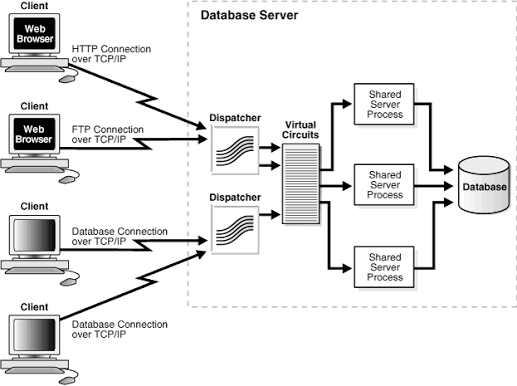

*Schéma : la connexion client vers son processus serveur dédié et sa PGA.*

#### 1. La trinité « Client - Processus - PGA »

Lorsque l'application de votre utilisateur se connecte à la base, une chaîne exclusive se met en place :

```
 [ Application Client ]
           │
           ▼  (Se connecte via le réseau)
┌────────────────────────────────────────────────────────┐
│ SERVEUR DE BASE DE DONNÉES (Machine)                  │
│                                                        │
│  ┌────────────────────────┐                             │
│  │ Processus Serveur Dédié│ ◄── Dédié à CE client seul │
│  └───────────┬────────────┘                             │
│              │ (Possède sa propre...)                  │
│              ▼                                         │
│  ┌────────────────────────┐                             │
│  │       Zone PGA         │ ◄── Mémoire privée non      │
│  │ (Program Global Area)  │     partagée dans la RAM   │
│  └────────────────────────┘                             │
└────────────────────────────────────────────────────────┘
```

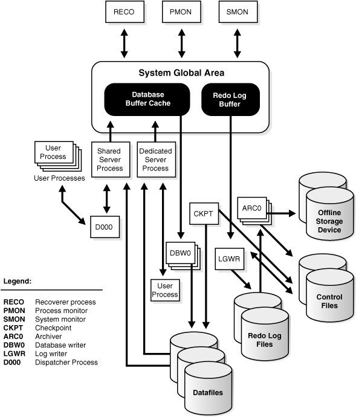

*Schéma : l'architecture des processus Oracle (client, serveur, background, SGA/PGA).*

* **1. Le client (le processus utilisateur)** : le programme qui tourne sur le poste de l'utilisateur ou sur un serveur web (script PHP, application Java, SQL Developer...). Ce processus émet des requêtes SQL mais ne sait pas les exécuter lui-même sur les fichiers.
* **2. Le processus serveur dédié (le travailleur)** : dès que le client se connecte, le système d'exploitation crée un processus système unique (ou un thread sous Windows), représentant exclusif du client sur le serveur. Il reçoit les ordres SQL, va chercher les données dans la mémoire globale (SGA) ou sur le disque, et renvoie les résultats. Il ne traite jamais les requêtes d'un autre client ; s'il ne fait rien, il dort et attend.
* **3. La PGA (Program Global Area, la mémoire privée)** : contrairement à la SGA partagée entre tout le monde, la PGA est une zone de RAM allouée spécifiquement pour ce processus serveur dédié. Aucun autre processus de la base ne peut lire ou écrire dans cette PGA.

#### 2. Que contient la PGA d'un processus dédié ?

* **La zone de tri (Sort Area)** : si l'utilisateur fait un ORDER BY ou un GROUP BY sur un gros volume, le processeur trie les lignes dans cette PGA.
* **La zone de hachage (Hash Area)** : utilisée pour lier deux tables rapidement lors d'une jointure (HASH JOIN).
* **L'état de la session** : variables de session SQL, historique des curseurs ouverts, droits de l'utilisateur.

#### 3. Avantages et limites du serveur dédié

* **Avantages :** performance maximale (le processus est toujours prêt pour son client), isolation totale (si une session sature sa PGA, les autres clients continuent de travailler normalement).
* **Limites :** gourmand en ressources — 5 000 utilisateurs connectés = 5 000 processus et 5 000 zones PGA en RAM, même si personne ne fait rien.

### 9. Serveur partagé : mutualiser les connexions

Pour gérer des milliers d'utilisateurs connectés sans faire exploser la RAM, l'alternative au serveur dédié est le mode **serveur partagé** (Shared Server). La règle d'or change : les connexions sont mutualisées, un petit groupe de processus serveurs se partage le travail de tout le monde.

#### 1. L'architecture du serveur partagé

Pour casser le lien exclusif client-processus, le système introduit deux intermédiaires : le **Dispatcher** (le répartiteur) et la **file d'attente** (Request Queue).

```
[ Client 1 ] ──┐
[ Client 2 ] ──┼─► [ Dispatcher ] ──► [ File d'attente ] ──► [ Processus Serveur Partagé 1 ]
[ Client 3 ] ──┘     (Le guichet)       (Request Queue)      [ Processus Serveur Partagé 2 ]
                                                               (Les serveurs disponibles)
```

* **1. Le Dispatcher (le guichet)** : le client n'utilise plus directement un processus serveur. Il envoie sa requête SQL au Dispatcher, qui la place dans une file d'attente commune en mémoire (SGA).
* **2. Le pool de processus partagés** : un nombre fixe et réduit de processus serveurs (par exemple 20 processus pour 1 000 utilisateurs) surveillent la file d'attente. Dès qu'un processus se libère, il prend la première requête, l'exécute et remet le résultat au Dispatcher, qui le renvoie au bon client.

#### 2. Le grand changement pour la mémoire (SGA vs PGA)

Un processus serveur partagé doit pouvoir traiter la requête du Client 1 puis, une seconde plus tard, celle du Client 2.

* **Le problème :** comme vu précédemment, les informations de session et les tris d'un client sont stockés dans sa zone privée (PGA). Si ces données restaient dans la PGA du processus 1, le processus 2 ne pourrait pas reprendre le travail du client.
* **La solution :** en mode serveur partagé, la mémoire de session du client (appelée **UGA** — User Global Area) est déplacée de la PGA vers la SGA. **Règle précise :** elle va dans le **Large Pool** s'il est configuré, sinon dans le **Shared Pool**. Ainsi, quel que soit le processus partagé qui prend la requête dans la file d'attente, il accède aux données de session du client puisqu'elles sont dans la zone commune.

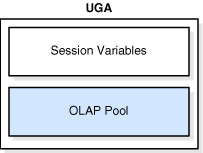

*Schéma : la User Global Area (UGA).*

#### 3. Comparaison : dédié vs partagé

| Caractéristique                            | Serveur dédié                                                          | Serveur partagé                                                            |
| ------------------------------------------- | ------------------------------------------------------------------------ | --------------------------------------------------------------------------- |
| Nombre de processus                         | Égal au nombre de clients connectés.                                   | Très inférieur au nombre de clients (pool).                               |
| Emplacement de la mémoire de session (UGA) | Dans la PGA (mémoire privée du processus).                             | Dans la SGA : Large Pool, ou Shared Pool si le Large Pool est absent.       |
| Utilisation idéale                         | Longues requêtes lourdes, batchs, sauvegardes, tâches DBA.             | Nombreuses connexions courtes (applications web, milliers de petits clics). |
| Comportement si le client dort              | Le processus serveur dédié dort aussi et consomme de la RAM pour rien. | Le processus partagé traite les requêtes des autres clients actifs.       |

En résumé, le serveur partagé fonctionne comme un centre d'appels : peu importe quel conseiller décroche, il peut ouvrir votre dossier (dans la SGA) et répondre. Vingt conseillers peuvent gérer des centaines de clients. Nous avons fait le tour de l'architecture physique et mémoire (processus, RAM, disques, sessions).

### 10. Les 5 processus background : DBWn, LGWR, CKPT, SMON, PMON

Ces cinq processus d'arrière-plan constituent le cœur de l'infrastructure logicielle d'une instance (comme Oracle). Ils s'exécutent en tâche de fond pour assurer la maintenance, la performance et la survie de la base.

| Processus          | Nom complet     | Rôle principal                                                                                                                                                                                                 | Interaction avec la SGA (RAM)                                             | Interaction avec le disque                                                                                                                  |
| ------------------ | --------------- | --------------------------------------------------------------------------------------------------------------------------------------------------------------------------------------------------------------- | ------------------------------------------------------------------------- | ------------------------------------------------------------------------------------------------------------------------------------------- |
| DBWn (n = 1, 2...) | DataBase Writer | Écrit les blocs modifiés de la mémoire vers le disque, de manière asynchrone, pour libérer de la place en RAM.                                                                                             | Lit le Buffer Cache à la recherche de blocs « sales » (dirty buffers). | Écrit dans les Datafiles.                                                                                                                  |
| LGWR               | Log Writer      | Écrit les journaux de transaction sur le disque dès un COMMIT pour garantir la durabilité.                                                                                                                   | Lit en continu le Redo Log Buffer (les reçus de modifications).          | Écrit dans les Redo Log Files.                                                                                                             |
| CKPT               | Checkpoint      | Déclenche un point de contrôle : demande à DBWn d'écrire les blocs sales, puis enregistre la position (SCN) de l'avancement. Il ne réécrit lui-même aucun bloc de données.                              | Met à jour les structures de contrôle stockées en SGA.                 | Écrit le SCN dans les Control Files et l'en-tête des Datafiles.                                                                           |
| SMON               | System Monitor  | Nettoie le système : récupération automatique de l'instance après un crash (au démarrage), coalescence de l'espace libre**dans les tablespaces (sur disque)** et nettoyage des segments temporaires. | Gère l'espace libre des structures globales de la SGA.                   | Lit les Redo Logs et applique la récupération (roll-forward) sur les Datafiles ; libère de l'espace disque.                              |
| PMON               | Process Monitor | Nettoie les sessions en échec : si un processus client plante, il libère ses ressources et ses verrous. Dans les versions antérieures, il enregistrait aussi le service de la base auprès du Listener.      | Libère les verrous et la mémoire de session (UGA) bloqués dans la SGA. | Communique avec les autres processus du système ; enregistre les services. Souvent décrit comme non impliqué dans les écritures disque. |

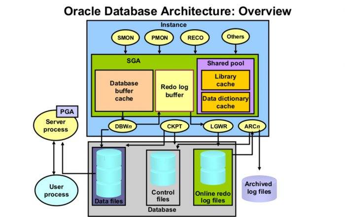

*Schéma : les deux processeurs d'écriture, DBWn (datafiles) et LGWR (Redo Log Files).*

#### Zoom sur le fonctionnement de chaque processus

* **DBWn** : il ne travaille pas dans l'urgence. Il attend que le Buffer Cache soit trop plein de blocs modifiés, ou qu'un signal de CKPT lui demande de vider une partie de la mémoire vers les Datafiles.
* **LGWR** : le processus le plus pressé et le plus critique. Il écrit dès qu'un utilisateur tape COMMIT, toutes les trois secondes, ou dès que le Redo Log Buffer est rempli au tiers (ou 1 Mo de redo, voir §17).
* **CKPT** : il agit comme un chef d'orchestre du temps. Lors d'un checkpoint, il **demande** à DBWn d'écrire les blocs en retard, puis met à jour le numéro de séquence (SCN) dans le fichier de contrôle. Contrairement à DBWn, **CKPT n'écrit pas de blocs de données lui-même**.
* **SMON** : si l'électricité est coupée, au redémarrage SMON se lève en premier. Il applique le journal de transaction (roll-forward) pour remettre la base dans l'état exact du crash. En tâche de fond, il concatène aussi les zones d'espace libre dans les tablespaces et nettoie les segments temporaires.
* **PMON** : si un utilisateur débranche son câble réseau en pleine transaction, PMON détecte que le processus client est mort, effectue un ROLLBACK automatique et libère les lignes verrouillées pour les autres utilisateurs.

### 11. Une SGA, N PGA : première vue d'ensemble

La règle d'or est simple : **dans une instance, il y a toujours une seule et unique SGA (partagée), mais autant de PGA (privées) qu'il y a de processus en cours.**

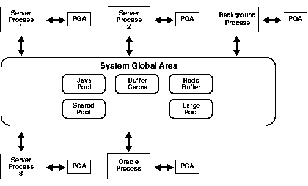

*Schéma : carte mémoire processus (SGA partagée, PGA privées).*

#### 1. L'analogie théâtrale

* **L'Instance = la scène de théâtre** : l'espace vivant, éphémère, en action. Tant que la pièce est jouée (l'instance démarrée), la scène existe. Si on éteint les feux, la scène redevient vide.
* **Les Processus = les acteurs** : les entités physiques qui font le travail. Certains ont des rôles en arrière-plan (DBWn, LGWR, PMON sont la troupe technique), d'autres sont des processus serveurs dédiés engagés pour jouer le texte (les requêtes SQL) dicté par un spectateur (le client).
* **La SGA = les décors et accessoires communs (sur la scène)** : un immense espace au milieu de la scène, auquel tous les acteurs accèdent en même temps. Si un acteur y dépose un accessoire (un bloc de données lu depuis le disque), un autre peut l'attraper immédiatement sans retourner dans les coulisses (le disque).
* **La PGA = le script personnel et la loge de l'acteur** : chaque acteur possède sa propre loge privée et son carnet de notes. Un acteur ne peut pas entrer dans la loge d'un autre. Il y stocke ses données personnelles (variables de session) et y prépare ses répliques et ses mouvements complexes (tris, hachages).

#### 2. Le modèle : 1 SGA, N PGA

```
┌───────────────────────────────────────────────────────────┐
│ INSTANCE (La Scène)                                       │
│                                                           │
│    ┌─────────────────────────────────────────────────┐    │
│    │                  UNE SEULE SGA                  │    │
│    │             (L'Espace Collectif)                │    │
│    │  [Buffer Cache]  [Shared Pool]  [Log Buffer]    │    │
│    └───────────────────────▲─────────────────────────┘    │
│                            │ (Accès partagé)              │
│            ┌───────────────┼───────────────┐              │
│            │               │               │              │
│    ┌───────▼───────┐┌──────▼───────┐┌──────▼───────┐      │
│    │  Processus 1  ││  Processus 2  ││  Processus N  │      │
│    │   (Acteur)    ││   (Acteur)    ││   (Acteur)    │      │
│    └───────┬───────┘└──────┬───────┘└──────┬───────┘      │
│            │               │               │              │
│    ┌───────▼───────┐┌──────▼───────┐┌──────▼───────┐      │
│    │     PGA 1     ││     PGA 2     ││     PGA N     │      │
│    │ (Loge Privée) ││ (Loge Privée) ││ (Loge Privée) │      │
│    └───────────────┘└───────────────┘└───────────────┘      │
└───────────────────────────────────────────────────────────┘
```

* **Pourquoi une seule SGA ?** Pour centraliser les données de la base. Si chaque processus avait sa propre copie des tables, deux utilisateurs ne verraient jamais la même chose et l'ordinateur gaspillerait sa RAM en doublons. La SGA garantit la cohérence : un seul endroit en mémoire pour les données communes.
* **Pourquoi N PGA ?** Pour que les processus ne se marchent pas sur les pieds. Si deux acteurs triaient des listes différentes dans le même carnet, ce serait un désastre. La PGA fournit tranquillité et sécurité à chaque travailleur.

## 3. La SGA : la mémoire partagée

### 12. Définition et dimensionnement

Dans l'architecture Oracle, la gestion de la SGA (Shared Global Area) a considérablement évolué pour simplifier le travail des administrateurs tout en maximisant les performances. Voici sa définition, son dimensionnement dynamique via `SGA_TARGET`, et l'optimisation matérielle par les HugePages.

#### 1. Définition et cycle de vie de la SGA

La SGA répond à trois caractéristiques fondamentales :

* **Unique** : il n'existe qu'une seule SGA par instance. Tous les processus (serveurs et arrière-plan) s'y connectent pour partager les données.
* **Allouée au STARTUP** : la SGA n'existe pas tant que la commande `STARTUP` n'a pas été lancée. Dès l'étape NOMOUNT, le système d'exploitation alloue un bloc massif de RAM continue à l'instance, selon les paramètres de configuration.
* **Volatile** : la SGA vit uniquement dans la RAM. Panne de courant ou `SHUTDOWN` : tout son contenu (caches de données, plans d'exécution SQL) est immédiatement effacé. Seule la base sur disque (durable) conserve les informations.

#### 2. Le dimensionnement automatique : SGA_TARGET (ASMM)

Historiquement, un DBA devait spécifier manuellement la taille de chaque sous-composant de la SGA (Buffer Cache, Shared Pool, Large Pool...). Si le Shared Pool manquait de place alors que le Buffer Cache en avait trop, la base plantait. Oracle a alors introduit l'**ASMM** (*Automatic Shared Memory Management*) via le paramètre `SGA_TARGET` :

```
       [ Taille globale fixée par SGA_TARGET = 16 Go ]
                             │
            ┌────────────────┴────────────────┐
            ▼ (Répartition dynamique par ASMM) ▼
┌──────────────────────┐ ┌──────────────────────┐ ┌────────────────┐
│  Buffer Cache (RAM)  │ │  Shared Pool (RAM)   │ │ Autres pools   │
│     (ex: 10 Go)      │ │     (ex: 5 Go)       │ │   (ex: 1 Go)   │
└──────────────────────┘ └──────────────────────┘ └────────────────┘
      ▲                        ▲
      └───────── Échange ──────┘  (ASMM ajuste les tailles en temps
                                  réel selon la charge de travail)
```

* **Le principe :** le DBA fixe uniquement la taille globale de la SGA via `SGA_TARGET` (par exemple `SGA_TARGET = 16G`).
* **L'automatisme :** un processus d'arrière-plan surveille l'utilisation. Si l'application enchaîne énormément de requêtes SQL différentes, le système réduit automatiquement le Buffer Cache pour agrandir le Shared Pool, sans interruption de service.

#### 3. L'optimisation matérielle : les HugePages (sous Linux)

Lorsque la SGA devient très grande (dizaines ou centaines de Go), le mécanisme classique de la MMU et de la table des pages commence à saturer le processeur.

* **Le problème sans HugePages :** par défaut, Linux découpe la mémoire en petites pages de 4 Ko. Pour une SGA de 64 Go, la table des pages doit contenir 16 millions de lignes. Elle ne tient plus dans le cache TLB du processeur : explosion des TLB Miss, l'ALU ralentit.
* **La solution :** les HugePages permettent d'allouer des pages bien plus grandes (2 Mo ou plus) spécialement pour la SGA.
  * Réduction de la table : 16 millions de pages → 32 000 pages pour 64 Go. La table devient minuscule.
  * TLB Hit à ~100 % : la table tient entièrement dans le cache TLB ; l'ALU obtient instantanément l'adresse physique de la SGA.
  * Mémoire verrouillée : les HugePages ne peuvent jamais être échangées sur le disque (pas de swapping/paging), d'où des performances maximales et constantes.

### 13. Vue d'ensemble des composants

La SGA n'est pas un bloc de mémoire monolithique : c'est une structure segmentée en plusieurs zones spécialisées appelées **pools**. Elle se compose de 4 composants principaux, d'une zone fixe (Fixed SGA) et de pools secondaires.

#### 1. Les 4 composants principaux (les piliers)

* **Le Database Buffer Cache** : la réplique en RAM des données du disque. Quand un processus serveur a besoin d'une ligne d'une table, il lit le bloc entier depuis le datafile et le stocke ici. Si un autre utilisateur demande les mêmes données, elles sont lues depuis ce cache, sans accès disque.
* **Le Shared Pool** : le cerveau de la SGA, dédié au code. Il contient le **Library Cache** (plans d'exécution des requêtes SQL compilées, pour éviter de les réanalyser à chaque fois) et le **Data Dictionary Cache / Row Cache** (métadonnées : définitions des tables, des colonnes, droits des utilisateurs).
* **Le Redo Log Buffer** : une mémoire tampon circulaire ultra-rapide. Dès qu'une donnée est modifiée, le reçu du changement (le vecteur de redo) y est inscrit. LGWR vide ce buffer en continu vers les Redo Log Files sur le disque.
* **Le Large Pool** : une zone optionnelle mais fortement recommandée, dédiée aux allocations massives qui encombreraient le Shared Pool (sauvegardes/restaurations RMAN, processus parallèles, UGA en mode serveur partagé).

#### 2. La Fixed SGA (la boussole interne)

Une toute petite zone (quelques mégaoctets) dont la taille est fixée par Oracle à la compilation du logiciel et ne peut pas être modifiée par le DBA. Elle fait office de tableau de bord : variables internes, pointeurs généraux et adresses qui permettent à l'instance de savoir où se trouvent les autres composants de la SGA. Analogie : le plan d'architecte placé à l'entrée du bâtiment.

#### 3. Les pools secondaires (les spécialistes)

* **Le Java Pool** : exécution du code Java dans la base (problèmes stockés, applications codées en Java).
* **Le Streams Pool** : utilisé par les outils de réplication de données (Oracle Streams, GoldenGate) pour stocker les informations à transférer d'une base à une autre.
* **Les buffers de taille de bloc non standard** : si vous importez des tablespaces configurés avec des blocs de 4/16/32 Ko alors que la base utilise 8 Ko, le système crée des espaces tampons distincts spécialement dimensionnés pour ces blocs.

### 14. Buffer Cache : blocs en RAM, propre / sale / CR

Le Database Buffer Cache conserve en RAM des copies des blocs de données provenant des Datafiles. Son but : réduire les accès disques en fournissant les données directement depuis la mémoire.

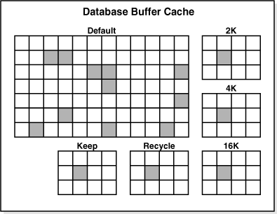

*Schéma : le Buffer Cache entre la SGA et les datafiles.*

#### 1. Les 3 états d'un bloc en RAM

* **Le bloc propre (Clean Buffer)** : identique à sa version sur le disque (lu depuis le disque, ou déjà écrit par DBWn). Aucune modification récente non sauvegardée : on peut immédiatement l'écraser (le réallouer) si le cache manque de place.
* **Le bloc sale (Dirty Buffer)** : modifié en RAM par une transaction (INSERT, UPDATE) mais pas encore écrit sur le disque par DBWn. Il ne peut absolument pas être écrasé tant que DBWn ne l'a pas sécurisé dans les Datafiles.
* **Le bloc CR (Consistent Read Buffer)** : une copie « fantôme ». Si l'utilisateur A modifie une ligne (le bloc devient sale) sans COMMIT et que l'utilisateur B lit cette ligne, B doit voir les anciennes données. Oracle crée en RAM un bloc CR en combinant le bloc actuel et les informations d'annulation (undo) pour garantir l'isolation de la transaction.

#### 2. L'algorithme d'éviction : point médian et touch count

Le Buffer Cache a une taille limitée (fixée par `SGA_TARGET`). Quand il est plein et qu'un processus doit charger un nouveau bloc depuis le disque, il doit en éliminer un ancien. Pour ne pas supprimer les blocs fréquemment utilisés, Oracle utilise une version améliorée du principe LRU (*Least Recently Used*), basée sur un **point médian** et un **compteur de touches** (Touch Count).

```
  [ Tête de Liste ] ◄─────────────────────────────────────────────┐
┌──────────────────────────────────────────────────────────────┐  │
│                   COMPARTIMENT CHAUD (Hot)                   │  │
│  Contient les blocs fréquemment accédés (Touch Count élevé) │  │
└──────────────────────────────┬───────────────────────────────┘  │ (Un bloc froid
                               │                                  │  très demandé
                         [Point Médian]                           │  devient chaud)
                               │                                  │
┌──────────────────────────────▼───────────────────────────────┘  │
│                   COMPARTIMENT FROID (Cold)                  │  │
│  Contient les blocs récents ou peu utilisés                  │  │
└──────────────────────────────┬───────────────────────────────┘
                               │
                               ▼
                        [ Queue de Liste ] ──► [ ÉVICTION ] (Blocs propres exclus)
```

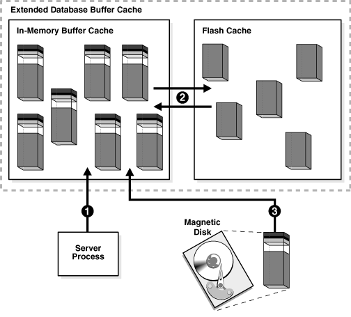

*Schéma : la recherche d'un bloc dans le Buffer Cache.*

* Le compartiment **chaud** représente environ 50 % de la liste (au sommet) : les blocs les plus populaires.
* Le compartiment **froid** est le reste de la liste (vers le bas) ; c'est là que sont injectés les nouveaux blocs lus sur le disque.

**Le mécanisme du Touch Count.** Chaque bloc possède un compteur dans son en-tête. À chaque accès, le processeur l'incrémente (avec une protection temporelle pour éviter qu'une lecture répétée de la même ligne ne fausse les statistiques).

1. **L'arrivée** : un nouveau bloc lu sur le disque entre juste sous le point médian, dans la section froide, avec un Touch Count initialisé à 1.
2. **La promotion** : si son Touch Count augmente (d'autres requêtes le demandent), il est propulsé au sommet de la section chaude.
3. **L'éviction** : lorsqu'il faut faire de la place, on part de la queue de liste (bas de la section froide) : si le bloc est sale, on demande à DBWn de s'en occuper et on passe au suivant ; s'il est propre avec un Touch Count bas (0 ou 1), il est immédiatement évincé.

Ce système à deux vitesses évite la « pollution du cache » : un balayage complet d'une table gigantesque (Full Table Scan) ne pollue que la section froide au lieu de chasser tous les blocs importants.

### 15. Shared Pool : Library Cache (plans) + Row Cache (dictionnaire)

Alors que le Buffer Cache stocke des données brutes, le Shared Pool est le « cerveau » logiciel de l'instance : il stocke le code SQL, les plans d'exécution et les métadonnées. Sa structure se divise en deux zones de cache interconnectées.

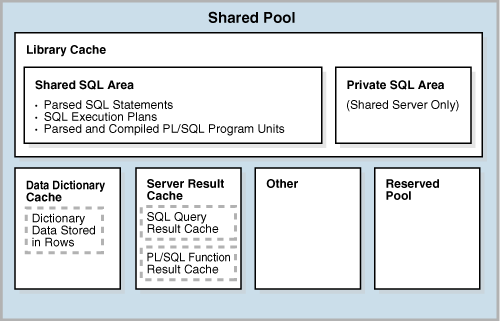

*Schéma : le Shared Pool (Library Cache + Row Cache).*

#### 1. Le Library Cache (le cache de code et de plans)

Son but : éviter au processeur de refaire les étapes lourdes d'analyse (parsing) d'une requête SQL. À la réception d'une requête, le processeur serveur effectue deux opérations :

1. **L'analyse syntaxique et sémantique** : vérifier que la commande est correcte et que l'utilisateur a les droits requis.
2. **L'optimisation** : calculer le chemin le plus rapide (quel index, quelle table en premier). Le résultat est le **plan d'exécution**.

Ces informations sont stockées dans le Library Cache sous forme de *Shared SQL Areas*.

* **Hard Parse (analyse lourde)** : si la requête n'est pas dans le Library Cache, tout doit être recalculé depuis zéro. Très coûteux en CPU.
* **Soft Parse (analyse légère)** : si une requête rigoureusement identique arrive, le système la trouve immédiatement, saute l'optimisation et réutilise le plan existant. Accès quasi instantané.

#### 2. Le Row Cache / Data Dictionary Cache (le cache des structures)

Pour valider une requête (la table `CLIENTS` existe-t-elle ? la colonne `TELEPHONE` est-elle bien un texte ?), il faut consulter le **dictionnaire de données**. Il est stocké physiquement sur le disque dans les tables système ; aller le lire à chaque requête rendrait l'ordinateur extrêmement lent.

* **Le rôle du Row Cache :** stocker en SGA les informations sur la structure de la base. On l'appelle « Row Cache » car, contrairement au Buffer Cache qui stocke des blocs entiers de 8 Ko, il stocke directement les lignes du dictionnaire (des enregistrements précis) : définitions des tables, types des colonnes, index, profils de sécurité et privilèges.

#### 3. L'interaction entre les deux caches

```
               [ Requête SQL reçue par le Serveur ]
                                │
                                ▼
 ┌─────────────────────────────────────────────────────────────┐
 │ SHARED POOL                                                 │
 │                                                             │
 │  ┌───────────────────────┐       ┌───────────────────────┐  │
 │  │     LIBRARY CACHE     │ ◄───► │       ROW CACHE       │  │
 │  │                       │       │                       │  │
 │  │ Stocke et cherche le  │       │ Fournit les schémas,  │  │
 │  │ plan d'exécution SQL  │       │ les droits et tables  │  │
 │  └───────────┬───────────┘       └───────────────────────┘  │
 └──────────────┼──────────────────────────────────────────────┘
                ▼
     [ Exécution immédiate ]
```

1. La requête arrive dans le Library Cache.
2. Si elle doit être analysée (parse), le Library Cache interroge le Row Cache, en RAM, pour obtenir instantanément les structures des tables et les droits de l'utilisateur.
3. Une fois les vérifications faites, le plan est créé, stocké dans le Library Cache pour les fois suivantes, et la requête passe à l'exécution.

### 16. Library Cache : hard parse, soft parse, session cursor cache

Pour optimiser les performances, le Library Cache contourne les opérations de parsing, coûteuses en CPU, en réutilisant les plans d'exécution déjà calculés. Il indexe ces plans dans une hiérarchie rigide Parent/Enfant. Le choix entre un hard parse, un soft parse et un accès au Session Cursor Cache détermine si la requête prend des **millisecondes** ou des **microsecondes**. *(Les durées ms/µs sont des ordres de grandeur indicatifs, pas des valeurs garanties.)*

#### 1. Cursor parent vs cursor enfant

* **Le parent (1 par texte unique)** : contient le texte exact de la requête SQL et sa valeur de hachage cryptographique.
* **Les enfants (N par parent)** : contiennent le plan d'exécution réel (calculé par l'optimiseur) et l'environnement d'exécution.

**Pourquoi un parent peut-il avoir plusieurs enfants ?** Si deux utilisateurs exécutent le même texte de requête (`SELECT * FROM employees`), ils partagent le même parent. Mais si l'utilisateur A a un schéma d'optimisation personnalisé, ou si sa table `employees` appartient à un schéma différent de celui de B, le processeur doit générer deux plans différents : deux curseurs enfants sous le même parent.

#### 2. Hard parse, soft parse et session cursor cache

* **Hard parse (le mode coûteux) — coût : ordre de grandeur, millisecondes (ms)** : le texte est complètement nouveau, aucun parent ne correspond. Le processeur doit effectuer les vérifications syntaxiques, interroger le Row Cache (tables/droits), allouer de la mémoire dans le Shared Pool et lancer l'optimiseur pour générer un nouveau plan depuis zéro. Très coûteux en CPU ; des milliers de hard parses par seconde verrouillent les latches du Shared Pool et dégradent gravement les performances.
* **Soft parse (le mode efficace) — coût : ordre de grandeur, microsecondes (µs)** : le texte existe déjà. Le processeur trouve le parent et un enfant valide pour l'environnement courant, vérifie les droits et réutilise le plan existant — il saute entièrement la phase d'optimisation.
* **Session Cursor Cache (le mode le plus rapide) — coût : quasi nul** : même un soft parse exige une recherche dans les chaînes de hachage du Library Cache, ce qui consomme des latches CPU. Pour s'en affranchir, la PGA du processus garde une **liste de raccourcis** : le Session Cursor Cache. Entre en jeu le paramètre `SESSION_CACHED_CURSORS` (la valeur par défaut récente est 50) qui fixe la taille de cette liste. La règle empirique des « plus de 3 exécutions » est liée à ce paramètre : au-delà d'un petit nombre de ré-exécutions de la même requête, le pointeur vers le curseur enfant du Library Cache est stocké directement dans la session ; le processeur saute alors complètement la recherche dans le Library Cache.

#### 3. Comment les bind variables évitent les doublons

Sans bind variables, une application génère un texte SQL unique pour chaque valeur distincte :

```sql
-- SANS bind variables (crée 3 curseurs PARENTS séparés -> 3 hard parses)
SELECT * FROM users WHERE id = 101;
SELECT * FROM users WHERE id = 102;
SELECT * FROM users WHERE id = 103;
```

Le texte différant, la base voit des requêtes totalement différentes : le Library Cache se remplit de millions de curseurs parents à usage unique, chassant les plans précieux.

Avec les bind variables, on remplace les valeurs par un paramètre (`:id` ou `?` selon le langage) :

```sql
-- AVEC bind variables (1 curseur PARENT -> 1 hard parse, puis des soft parses)
SELECT * FROM users WHERE id = :id;
```

**Résultat :** chaque exécution suivante utilise exactement le même texte de parent. Un seul hard parse la première fois ; chaque requête ultérieure avec une valeur différente est un soft parse ultra-rapide ou un accès au Session Cursor Cache. Économie massive de RAM et de CPU.

### 17. Redo Log Buffer : journal circulaire, LGWR le vide au COMMIT

Le Redo Log Buffer est le troisième composant vital de la SGA : une zone RAM ultra-rapide qui recueille les « reçus » de transactions avant qu'ils ne soient écrits sur le disque. Son fonctionnement repose sur un mécanisme circulaire et une règle de synchronisation stricte assurée par LGWR (Log Writer).

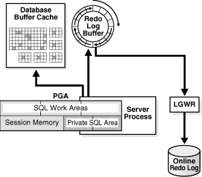

*Schéma : le Redo Log Buffer et son vidage par LGWR.*

#### 1. Qu'est-ce qu'un buffer circulaire ?

Le Redo Log Buffer est structuré comme un anneau de mémoire continu. Contrairement aux autres caches (qui utilisent des algorithmes de remplacement complexes comme le Touch Count du Buffer Cache), le Redo Log Buffer se remplit et se vide de manière séquentielle.

```
                ──► [ Entrée 1: UPDATE ] ──►
              │                             │
     [ Entrée 4: INSERT ]           [ Entrée 2: DELETE ]
              ▲                             │
              │                             ▼
                ◄── [ Entrée 3: COMMIT ] ──◄

   Les sessions écrivent leurs entrées les unes après les autres ;
   LGWR recopie (flush) le contenu vers le disque et libère l'espace devant lui.
```

* **Qui écrit ?** Ce sont les **processus utilisateurs (sessions)** qui, en exécutant des instructions DML (INSERT, UPDATE, DELETE), écrivent de petits vecteurs de changement (les *redo entries*) dans le buffer, les uns après les autres.
* **Qui vide ?** **LGWR** ne « chase » pas la queue du tampon en tant qu'écrivain : il **recopie** le contenu du buffer vers les Redo Log Files sur le disque, ce qui libère l'espace devant lui. Une fois qu'une section est écrite sur le disque, elle est marquée comme réutilisable.
* **Pas d'éjection :** les entrées ne sont jamais choisies pour être supprimées ; le pointeur avance simplement.

#### 2. Quand LGWR vide-t-il le buffer vers le disque ?

LGWR est très agressif et optimisé : il n'attend pas que le buffer soit plein. Il vide la mémoire vers les Redo Log Files sur disque dès que l'un des déclencheurs suivants se produit :

1. **Au COMMIT** (le déclencheur le plus critique) : dès que l'utilisateur tape COMMIT, sa session attend que LGWR ait copié les entrées de redo de la transaction sur le disque. Une fois sur le disque, la transaction est légalement « durable ».
2. **Toutes les 3 secondes** : si la base est complètement inactive, LGWR se réveille sur un minuteur toutes les 3 secondes pour vider les rares changements accumulés.
3. **Lorsque le buffer est rempli au tiers** : si l'activité est intense, LGWR se réveille dès que le buffer est rempli au tiers de sa capacité. Les versions modernes déclenchent aussi le flush à partir d'un volume d'environ **1 Mo** de redo généré.
4. **Avant une écriture de DBWn** : sous le protocole *Write-Ahead Logging* (WAL), DBWn ne peut pas écrire un bloc « sale » sur le disque tant que LGWR n'a pas écrit l'entrée de redo correspondante. Si DBWn doit écrire, il signale LGWR pour vider d'abord le buffer.

#### 3. Pourquoi cette architecture maximise la performance

Écrire dans les datafiles est lent (I/O aléatoires : la tête du disque ou le contrôleur SSD doit trouver l'emplacement exact de la ligne). Grâce au Redo Log Buffer et à LGWR :

* La base ne fait que des **I/O séquentielles** lors d'un COMMIT : LGWR ajoute simplement les données à la fin du fichier de log actif, ce qui est extrêmement rapide.
* Le système rend le COMMIT quasi instantané, tout en gardant sur le disque le « plan de reconstruction » du changement : même si une panne survient une milliseconde plus tard, le redo permet de rejouer la modification.

### 18. Large Pool : les gros tampons (serveur partagé, parallèle, RMAN)

Le Large Pool est un composant optionnel mais parfois critique de la SGA. Il a été conçu pour gérer les opérations massives en mémoire qui pollueraient sinon le Shared Pool. Contrairement au Shared Pool (qui gère des centaines de milliers de petits objets avec des algorithmes complexes), le Large Pool alloue la mémoire en gros blocs séquentiels et n'utilise pas de mécanisme de vieillissement (LRU).

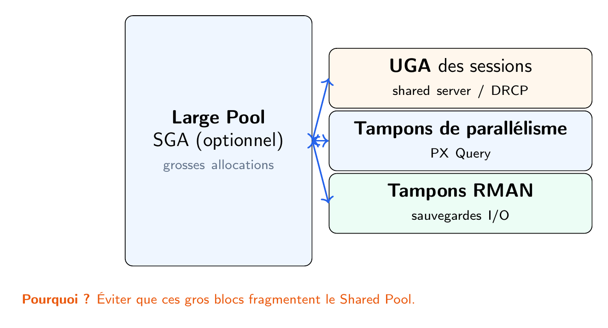

*Schéma : la zone du Large Pool dans la SGA.*

#### 1. Pourquoi un Large Pool ?

Avant son introduction, les opérations lourdes d'arrière-plan demandaient leur mémoire au Shared Pool. Comme elles exigeaient d'énormes blocs de RAM contigus, elles forçaient le Shared Pool à évincer des milliers de plans SQL mis en cache. Résultat : des pics de CPU, des hard parses fréquents et l'erreur tant redoutée **ORA-04031 : unable to allocate... bytes of shared memory**. Le Large Pool agit comme une zone d'isolation dédiée pour empêcher cela.

#### 2. Les trois cas d'usage principaux du Large Pool

**A. Architecture serveur partagé (Shared Server)**

En mode serveur partagé, la mémoire de session de l'utilisateur — l'**UGA** — ne peut pas rester dans la PGA privée d'un seul processus : elle doit vivre dans la SGA partagée.

* **Sans Large Pool :** l'UGA est placée dans le **Shared Pool**, qu'elle fragmente en continu au rythme des connexions/déconnexions.
* **Avec le Large Pool :** l'UGA (variables de session, contextes de tri, curseurs ouverts) est stockée dans le **Large Pool**, ce qui garde le Shared Pool propre et rapide.

**B. Exécution parallèle (Parallel Query)**

Lors d'une grosse requête parallèle (`SELECT /*+ PARALLEL */`), le processus coordinateur répartit la tâche entre plusieurs esclaves (serveurs d'exécution en parallèle). Ces processus doivent échanger rapidement d'immenses volumes de lignes en mémoire : le Large Pool fournit les buffers de messages, autoroute à haute vitesse pour la communication entre processus parallèles.

**C. Oracle RMAN (sauvegarde et restauration)**

Quand RMAN sauvegarde ou restaure la base, il lit des blocs massifs depuis les disques et les prépare pour la destination de sauvegarde. RMAN met en place de grands tampons (buffers d'I/O disque/bande) pour faire transiter ces données — le Large Pool assure que vos sauvegardes quotidiennes ne ralentissent jamais les plans SQL opérationnels de vos utilisateurs.

#### Résumé des pools de la SGA

| Pool        | Contenu principal                                         | Mode d'allocation            | Impact s'il manque                         |
| ----------- | --------------------------------------------------------- | ---------------------------- | ------------------------------------------ |
| Shared Pool | Petits fragments de code, texte SQL, plans, dictionnaire. | Dynamique, très fragmenté. | CPU saturé par les hard parses.           |
| Large Pool  | Gros blocs pour l'UGA, RMAN et les requêtes parallèles. | Gros blocs contigus.         | Fragmentation du Shared Pool et ORA-04031. |

### 19. Latch vs mutex : le prix du partage, 1 copie pour N sessions

Partager un espace mémoire unique (la SGA) entre des milliers de sessions est un avantage majeur : réduction de la consommation de RAM, pas de calculs CPU dupliqués, moins d'I/O disque. Mais ce partage a un prix. Quand N sessions veulent accéder à une copie unique d'un bloc de données ou d'un plan SQL à la même milliseconde, la base doit empêcher la corruption des données : elle utilise des mécanismes internes de sérialisation ultra-légers — les **latches** et les **mutexes**.

#### 1. Latches vs mutexes : les gardiens haute vitesse

Contrairement aux verrous de lignes de tables (locks/enqueues) qui peuvent durer des heures, les latches et mutexes vivent uniquement dans la RAM de la SGA pour protéger des structures mémoire internes (code C/C++). Ils durent une fraction de microseconde.

**Les latches (le gardien traditionnel)** : un mécanisme de verrouillage interne de bas niveau qui protège de vastes ensembles d'objets de la SGA (par exemple toute une chaîne de blocs du Buffer Cache).

* Comment ça marche : pour modifier une structure, un processus doit acquérir le latch ; tant qu'il le tient, aucun autre processus ne peut toucher aux objets protégés.
* Le coût : si plusieurs CPU essaient d'acquérir le même latch, ils « spin » (bouclent en consommant des cycles CPU) en attendant qu'il se libère → pics de CPU.

**Les mutexes (l'alternative moderne et ciblée)** : un *Mutual Exclusion object* : un mécanisme plus récent, plus petit et nettement plus rapide, introduit pour remplacer les latches sur des opérations précises — surtout dans le Library Cache.

* Comment ça marche : au lieu de protéger tout un groupe d'objets, un mutex est **encastré directement dans l'objet lui-même** (par exemple un curseur parent SQL).
* Le bénéfice : bien meilleure concurrence — une session ne verrouille que l'objet exact qu'elle utilise, avec moins d'instructions CPU pour acquérir et relâcher le mutex que pour un latch.

#### 2. Le principe à retenir : le prix du partage

$$
\text{SGA} = \text{Économies massives en RAM, CPU et I/O} \ \longrightarrow \ \text{Impose des attentes (verrous/latches)}
$$

* **Le gain RAM/CPU/IO :** grâce à 1 copie pour N sessions, un bloc lu par un utilisateur profite à tous (pas d'I/O), et une requête compilée par un utilisateur est réutilisée par tous (pas de hard parse CPU).
* **Le coût en événements d'attente :** si l'application n'utilise pas de bind variables, des milliers de sessions modifient en permanence la structure du Library Cache pour injecter de nouveaux textes SQL : contention intense sur les latches, ou chocs de mutexes. Les CPU passent plus de temps à se disputer les clés des structures mémoire qu'à calculer.

## 4. La PGA : la mémoire privée

### 20. Définition : une par processus, sans verrou, coût linéaire en N

La PGA (Program Global Area) est exactement l'opposé de la SGA partagée. Là où la SGA exige des outils de synchronisation complexes (latches, mutexes) pour laisser plusieurs sessions toucher une seule copie de données, la PGA repose sur une **isolation totale**.

#### 1. Ce que cela signifie : une par processus, sans verrou

* **Strictement privée :** chaque processus serveur ou d'arrière-plan qui tourne sur le système d'exploitation reçoit son propre espace RAM isolé : sa PGA.
* **Zéro contention (lock-free) :** comme le processus A ne peut ni voir, ni lire, ni écrire dans la PGA du processus B, il n'a jamais à demander la permission. Pas de latches, pas de mutexes, pas d'événements d'attente dans la PGA. La CPU exécute les calculs de l'ALU, les tris de lignes et la gestion des variables de session à pleine vitesse, sans jamais spinner ni attendre un autre utilisateur.

#### 2. Le revers : coût RAM linéaire (O(N))

Être lock-free rend la PGA très rapide, mais introduit une contrainte matérielle : le coût mémoire croît **linéairement** (O(N)) avec le nombre de connexions concurrentes (N).

```
[ 1 connexion client ]    ──►  1 processus dédié  ──►  1 PGA (ex: 20 Mo)   = Total: 20 Mo
[ 10 connexions clients ] ──► 10 processus dédiés ──► 10 PGA (ex: 20 Mo)   = Total: 200 Mo
[ 1 000 connexions ]      ──► 1 000 processus dédiés ──► 1 000 PGA (ex: 20 Mo) = Total: 20 Go !
```

* **La SGA est statique :** avec 1 utilisateur ou 10 000, la SGA est allouée au STARTUP et sa taille reste fixe (par ex. 32 Go).
* **La PGA est dynamique et cumulative :** chaque nouvelle connexion en mode dédié crée un processus et demande une nouvelle allocation de RAM privée à l'OS. Avec une PGA moyenne de 20 Mo par session, 1 000 utilisateurs actifs consomment automatiquement 20 Go de RAM, indépendamment de la taille de la SGA.

#### 3. Serveur dédié et menace linéaire

Ce coût linéaire explique pourquoi les bases ne montent pas en charge indéfiniment en mode dédié. Une pointe soudaine de 5 000 utilisateurs peut faire dépasser la RAM physique : l'OS se met alors à échanger des blocs sur le disque dur (swapping) — ou le *Linux Out-Of-Memory (OOM) Killer* plante brutalement l'instance. Pour gérer ce coût, les DBA modernes utilisent `PGA_AGGREGATE_TARGET` afin que l'instance réduise automatiquement les zones de tri des sessions individuelles quand la somme des PGA menace de dépasser la RAM.

### 21. Composants : Session Memory, Private SQL Area, SQL Work Areas

La mémoire privée d'un processus — la PGA — est divisée en zones fonctionnelles très spécialisées. Contrairement aux pools partagés de la SGA, ces composants sont entièrement dédiés à la gestion de l'état d'une seule session, de ses curseurs actifs et de ses opérations lourdes (tris, hachages). La structure se décompose en trois couches principales.

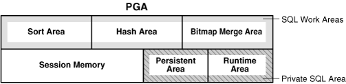

*Schéma : la répartition interne d'une PGA.*

#### 1. La Session Memory (la carte d'identité)

La mémoire de base qui suit le profil de connexion et l'état de l'utilisateur.

* **Ce qu'elle stocke :** variables de session, privilèges de connexion, rôles actifs, variables de paquet PL/SQL (le cas échéant).
* **Où elle vit :** en serveur dédié, elle reste dans la PGA privée ; en serveur partagé, cette couche migre vers la SGA (Large Pool, sinon Shared Pool) — c'est la fameuse UGA (§9).

#### 2. La Private SQL Area (le plan prévu pour un curseur)

Chaque fois qu'une session exécute une requête SQL, le processus crée une Private SQL Area qui relie cette session au plan d'exécution global stocké dans le Library Cache de la SGA. Elle se divise en deux parties aux durées de vie différentes :

* **La zone persistante (statique) :** valeurs des variables liées (bind), définitions des types de données, métadonnées de la requête. Elle vit aussi longtemps que le curseur reste ouvert (tant que l'application garde la déclaration de la requête).
* **La zone runtime (dynamique) :** état d'exécution — combien de lignes ont déjà été extraites, à quelle étape du plan on en est. Elle est libérée dès que la requête se termine ou que la dernière ligne est extraite, même si le curseur reste ouvert.

#### 3. Les SQL Work Areas (la grosse machinerie)

La partie la plus volatile et la plus gourmande de la PGA. Elle est allouée dynamiquement dès qu'une requête nécessite une manipulation de données lourde en mémoire.

* **Sort Area :** allouée pour un ORDER BY, un GROUP BY ou un DISTINCT. La CPU trie entièrement les lignes dans cet espace privé pour éviter le disque.
* **Hash Area :** utilisée pour un HASH JOIN. Pour lier deux grandes tables, le processus lit la plus petite, construit dans cet espace une table de hachage haute vitesse, puis « streame » la seconde table contre elle pour un appariement quasi instantané.
* **Bitmap Merge Area :** uniquement pour les requêtes qui utilisent des index bitmap : on récupère les chemins de bits de plusieurs scans d'index et on les fusionne en mémoire pour résoudre les conditions AND/OR avant d'extraire les lignes.

#### Récapitulatif de l'allocation mémoire de la PGA

```
┌────────────────────────────────────────────────────────┐
│ PGA (Mémoire privée de session)                        │
├────────────────────────────────────────────────────────┤
│ 1. SESSION MEMORY (Connexions, état PL/SQL, variables) │
├────────────────────────────────────────────────────────┤
│ 2. PRIVATE SQL AREA                                    │
│   ┌──────────────────────────────────────────────────┐ │
│   │ Zone persistante (valeurs bind, types de données)│ │
│   ├──────────────────────────────────────────────────┤ │
│   │ Zone runtime (compteurs de lignes, état execution)│ │
│   └──────────────────────────────────────────────────┘ │
├────────────────────────────────────────────────────────┤
│ 3. SQL WORK AREAS                                      │
│   ┌───────────────┐ ┌───────────────┐ ┌──────────────┐ │
│   │   Sort Area   │ │   Hash Area   │ │ Bitmap Merge │ │
│   └───────────────┘ └───────────────┘ └──────────────┘ │
└────────────────────────────────────────────────────────┘
```

Si le volume de données d'un tri ou d'un hachage dépasse la taille maximale autorisée pour les SQL Work Areas, le processus passe en mode One-Pass ou Multi-Pass : il fige l'allocation mémoire et fait déborder les lignes excédentaires sur le disque, dans le **tablespace TEMP** (voir §31).

### 22. Work Areas : optimal (RAM) / one-pass / multi-pass

Quand un plan d'exécution exige une manipulation de données dans les SQL Work Areas (Sort Area pour un ORDER BY, Hash Area pour un HASH JOIN), Oracle doit décider comment traiter les données selon la taille de mémoire autorisée par `PGA_AGGREGATE_TARGET`. La base classe automatiquement l'exécution dans l'un de trois modes.

#### 1. Mode optimal (100 % RAM) — performance maximale

* Ce qui se passe : le jeu de données entier tient dans la RAM allouée de la SQL Work Area.
* I/O disque : zéro. Tout se passe à vitesse nanoseconde dans la mémoire privée du processus.
* Déroulé : les lignes sont extraites, triées ou hachées complètement en mémoire, puis renvoyées directement au client.

#### 2. Mode one-pass (RAM + 1 passage disque) — débordement contrôlé

* Ce qui se passe : le jeu de données est trop gros pour la work area. Oracle lit une portion, la traite en mémoire, et écrit le résultat intermédiaire (un « run ») dans le tablespace TEMP sur disque.
* I/O disque : minimal — une écriture, puis une lecture à la fin pour fusionner les résultats intermédiaires.
* Performance : plus lente qu'optimal à cause de la latence disque, mais maîtrisée par le système pour ne pas bloquer la mémoire du serveur.

#### 3. Mode multi-pass (RAM + plusieurs passages disque) — le goulot d'étranglement

* Ce qui se passe : le jeu de données est si énorme que même les « runs » intermédiaires écrits sur le disque ne peuvent pas être fusionnés avec la RAM disponible de la work area.
* I/O disque : extrême. Le processus découpe les données en plusieurs étages et réécrit sans cesse des blocs dans le tablespace TEMP, les relis, re-trie des portions, les réécrit — en plusieurs cycles successifs (passages).
* Performance : exécrable. La CPU passe presque tout son temps à attendre les I/O disque physiques, transformant une requête de quelques secondes en une opération pouvant durer des heures.

#### Résumé de l'exécution des work areas

```
[ Taille du jeu de données vs PGA work area allouée ]
        │
        ├─► Tient dans la RAM ───────────────► OPTIMAL    (100 % RAM, rapide)
        ├─► Déborde légèrement ──────────────► ONE-PASS   (déborde vers TEMP une fois)
        └─► Déborde massivement ─────────────► MULTI-PASS (laboure TEMP, très lent)
```

| Mode d'exécution | Mémoire utilisée | Usage du disque TEMP | Niveau de performance |
| ----------------- | ------------------ | ------------------------------------- | --------------------- |
| Optimal | 100 % RAM | Aucun | Ultra rapide |
| One-Pass | RAM max allouée | Un seul cycle écriture/lecture | Acceptable / retardé |
| Multi-Pass | RAM max allouée | Boucles intenses de lecture/écriture | Critiquement lent |

Les DBA surveillent activement la vue de performance `V$SQL_WORKAREA_ACTIVE` pour détecter les opérations en cours en mode One-Pass ou Multi-Pass. Si des exécutions Multi-Pass sont détectées, il faut augmenter `PGA_AGGREGATE_TARGET` ou réécrire la requête pour traiter moins de lignes.

### 23. Dédié vs shared server vs DRCP : où part l'UGA ?

La destination de l'**UGA** (User Global Area — l'état de session des utilisateurs : variables, curseurs ouverts, tracking) dépend entièrement du modèle de connexion choisi. Comme l'UGA doit toujours être accessible par le processus qui exécute votre SQL, changer d'architecture force la base à déplacer l'UGA entre la mémoire privée de l'OS (PGA) et la mémoire partagée de l'instance (SGA).

**Règle générale à retenir :** en mode dédié, l'UGA vit dans la PGA ; en mode partagé, elle vit dans la SGA — dans le **Large Pool** s'il est configuré, sinon dans le **Shared Pool** (§9, §18).

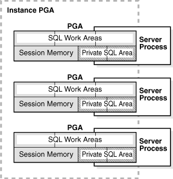

*Schéma : l'instance Oracle et ses zones PGA.*

#### 1. Serveur dédié : l'UGA dans la PGA

* **Où va l'UGA :** dans la PGA privée du processus serveur dédié.
* **Pourquoi :** ce processus appartient exclusivement à cette connexion client pendant toute sa vie ; aucun autre processus n'a besoin de voir ces données de session.
* **Impact mémoire :** rapide et lock-free, mais la RAM consomme linéairement avec le nombre d'utilisateurs connectés.

#### 2. Serveur partagé : l'UGA dans la SGA (Large Pool, sinon Shared Pool)

* **Où va l'UGA :** dans la SGA partagée, son emplacement exact dépendant de la configuration : **Large Pool** s'il est paramétré, sinon **Shared Pool**.
* **Pourquoi :** n'importe quel processus partagé du pool doit pouvoir prendre votre requête dans la file d'attente et l'exécuter ; pour cela, il doit lire votre identité de session, ce qui n'est possible que si l'UGA est dans la zone commune (SGA).
* **Impact mémoire :** économie massive de RAM système, mais la gestion de la mémoire de session bascule dans la SGA partagée (avec du partage = des latches).

#### 3. DRCP (Database Resident Connection Pool) : l'UGA dans la PGA (mutualisée)

Le DRCP est l'architecture la plus moderne (essentielle pour les langages web sans état comme PHP, Python ou Node.js). Il combine la performance du serveur dédié et la capacité de passage à l'échelle du serveur partagé en **mutualisant de vrais processus serveurs dédiés** (Pooled Servers).

* **Où va l'UGA :** dans la PGA du processus mutualisé prêté par le pool.
* **Pourquoi :** quand une requête web arrive, le DRCP confie au client un processus dédié déjà créé. Pendant la durée de cette requête rapide, tout se passe exactement comme en serveur dédié. À la fin, la session est détachée, l'UGA est effacée ou recyclée, et le processus retourne dans le pool.
* **Impact mémoire :** passage à l'échelle maximal — des milliers de connexions web partagent un petit pool de processus, la mémoire reste isolée dans des PGA privées sans encombrer la SGA.

#### Tableau comparatif direct

| Modèle de connexion | Emplacement de l'UGA              | Cible mémoire principale             | Idéal pour                                                           |
| -------------------- | --------------------------------- | ------------------------------------- | --------------------------------------------------------------------- |
| Serveur dédié      | PGA (mémoire OS privée)         | RAM du processus local                | Gros batch, rapports lourds, tâches DBA.                             |
| Serveur partagé     | SGA (mémoire instance partagée) | Large Pool (ou Shared Pool si absent) | Architectures héritées avec connexions persistantes mais inactives. |
| DRCP                 | PGA (empruntée dynamiquement)    | RAM du processus mutualisé           | Applications web modernes, microservices (sans état).                |

### 24. Diagnostic : V$PGASTAT, V$SQL_WORKAREA_ACTIVE, V$SQL_WORKAREA_HISTOGRAM, V$SGA_DYNAMIC_COMPONENTS

Pour surveiller, diagnostiquer et équilibrer la tension mémoire entre la SGA partagée et la croissance linéaire de la PGA, Oracle fournit des vues de performance dynamiques (vues V$). **À retenir :** la PGA isole et va vite, mais coûte N fois la RAM.

#### 1. Les outils de diagnostic (vues V$)

**A. V$PGASTAT — le tableau de bord PGA de l'instance.** Statistiques globales sur l'utilisation courante de la PGA et la santé des allocations.

* Indicateurs clés :
  * `aggregate PGA target parameter` : le réglage courant de `PGA_AGGREGATE_TARGET`.
  * `total PGA allocated` : la quantité réelle de RAM physique reliée à toutes les PGA utilisateurs.
  * `cache hit percentage` : indicateur vital — proche de 100 %, la quasi-totalité des work areas s'exécute en mode optimal ; s'il chute, les processus labourent le disque.

**B. V$SQL_WORKAREA_ACTIVE — les opérations lourdes en temps réel.** Montre exactement ce qui tourne en ce moment en mémoire et nécessite une Work Area (tris, hachages, bitmaps).

* Utilité : si un utilisateur se plaint qu'une requête est bloquée, on consulte cette vue : elle révèle l'instruction SQL exacte (SQL_ID), la RAM réellement consommée (ACTUAL_MEM_USED) et s'il y a débordement dans le tablespace TEMP (TEMP_SPACE_ALLOCATED).

**C. V$SQL_WORKAREA_HISTOGRAM — la santé historique du dimensionnement.** Pas le temps réel : un histogramme de comportement des work areas depuis le démarrage de l'instance.

* Utilité : il découpe les exécutions en tranches de taille (2 Mo, 4 Mo, 64 Mo...) et compte combien de fois les requêtes de ces tranches ont tourné en Optimal, One-Pass ou Multi-Pass. Si les nombres s'accumulent dans la colonne Multi-Pass pour les grosses tranches, c'est que `PGA_AGGREGATE_TARGET` est trop restrictif pour votre charge.

**D. V$SGA_DYNAMIC_COMPONENTS — le suivi du réglage ASMM.** Comme `SGA_TARGET` redimensionne automatiquement Buffer Cache, Shared Pool et Large Pool en temps réel, il faut pouvoir tracer ces changements.

* Utilité : cette vue enregistre la taille courante, min, max et le dernier moment où un composant a été redimensionné automatiquement. Des redimensionnements constants et agressifs entre Shared Pool et Buffer Cache (« memory churning ») signalent que `SGA_TARGET` est trop petit pour la charge.

#### 2. L'équilibre architectural à retenir

```
  ┌────────────────────────────────────────────────────────┐
  │                  L'ÉQUILIBRE MÉMOIRE                   │
  ├───────────────────────────┬────────────────────────────┤
  │        SGA PARTAGÉE       │         PGA PRIVÉE         │
  ├───────────────────────────┼────────────────────────────┤
  │  • Une copie pour tous    │  • Un seau par processus   │
  │  • Économise RAM et CPU   │  • Lock-free et ultrarapide│
  │  • Impose latchs/mutexes  │  • Coûte N fois la RAM     │
  └───────────────────────────┴────────────────────────────┘
```

La tension fondamentale revient toujours à ceci :

* La **SGA** économise les ressources mais introduit de la contention : elle force les sessions à se synchroniser (latches/mutexes) pour lire un seul bloc de RAM.
* La **PGA** optimise la vitesse mais détruit la montée en charge : chaque processus a son espace de travail isolé et calcule à vitesse matérielle sans jamais se verrouiller. Mais comme elle ne partage rien, son empreinte mémoire croît linéairement. 100 sessions dédiées peuvent prendre 2 Go ; 10 000 en demanderont 200 Go, juste pour leurs PGA.

## 5. Lien entre les deux mémoires

### 25. Shared SQL Area (SGA) vs Private SQL Area (PGA)

C'est la jonction parfaite entre la SGA (l'espace public partagé) et la PGA (l'espace privé de chaque processus). On comprend ici concrètement comment la base exécute une requête SQL pour un utilisateur sans dupliquer le travail des autres. Pour exécuter une seule et même requête, Oracle sépare le travail en deux composants complémentaires.

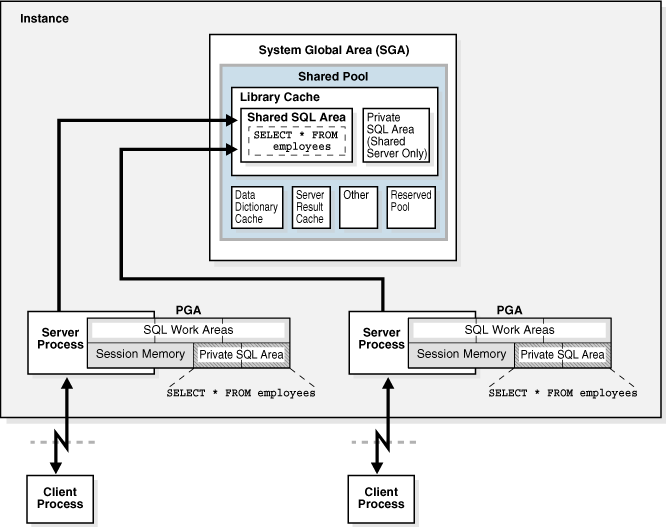

*Schéma : le lien entre la Shared SQL Area (SGA) et la Private SQL Area (PGA).*

#### 1. L'anatomie du lien : public vs privé

Lorsqu'un processus serveur exécute une requête SQL pour un client, il crée un pont invisible entre sa loge privée et la scène commune :

```
┌────────────────────────────────────────────────────────┐
│ PGA PRIVÉE DU PROCESSUS (1 par session)                │
│                                                        │
│  ┌──────────────────────────────────────────────────┐  │
│  │ PRIVATE SQL AREA                                 │  │
│  │  • Valeur des variables liées (ex: :id = 101)   │  │
│  │  • État d'avancement (ex: "lu 42 lignes sur 100")│  │
│  └────────────────────────┬─────────────────────────┘  │
└───────────────────────────┼────────────────────────────┘
                            │ (Pointe vers...)
                            ▼
┌────────────────────────────────────────────────────────┐
│ SGA PARTAGÉE (1 pour toute l'instance)                 │
│                                                        │
│  ┌──────────────────────────────────────────────────┐  │
│  │ SHARED POOL -> LIBRARY CACHE                     │  │
│  │  ┌────────────────────────────────────────────┐  │  │
│  │  │ SHARED SQL AREA                            │  │  │
│  │  │  • Texte exact de la requête SQL           │  │  │
│  │  │  • Plan d'exécution calculé par l'optimiseur│  │  │
│  │  └────────────────────────────────────────────┘  │  │
│  └──────────────────────────────────────────────────┘  │
└────────────────────────────────────────────────────────┘
```

**A. La Shared SQL Area (dans la SGA : l'universel).** Située au cœur du Library Cache (Shared Pool), elle contient les éléments immuables de la requête, identiques pour tous les utilisateurs :

* Le **texte SQL** : la chaîne brute de la requête (par exemple `SELECT * FROM employes WHERE id_dept = :id`).
* Le **plan d'exécution** : la « recette » calculée par le processeur pour aller chercher les données (quel index, dans quel ordre lier les tables).
* Le gain : elle est unique. Si 500 utilisateurs exécutent la même requête, il n'y a qu'une seule Shared SQL Area en RAM — économie de CPU (pas de hard parse) et de mémoire.

**B. La Private SQL Area (dans la PGA : le personnel).** Située dans la mémoire privée du processus utilisateur (PGA), elle contient les données dynamiques spécifiques à votre exécution en ce moment précis :

* Les **bind variables** : c'est ici que l'ordinateur stocke que, pour votre session, `:id` vaut 101 (pendant qu'un autre utilisateur aura stocké 202 dans sa propre PGA).
* L'**état d'avancement (runtime state)** : les pointeurs de curseur qui indiquent où en est l'ALU dans l'extraction — « le client demande les lignes par paquets de 10, j'ai renvoyé les 10 premières, je suis arrêté à la ligne 11 ».
* L'avantage : comme elle est dans la PGA, elle est accessible sans aucun verrou (pas de latch ni de mutex), garantissant une exécution ultra-rapide.

#### 2. Pourquoi cette séparation est-elle géniale ?

Imaginons une banque où 1 000 guichetiers consultent des soldes en même temps.

1. Grâce à la **SGA** : le code de l'application et la logique de recherche du compte ne sont analysés et stockés qu'une seule fois dans la Shared SQL Area. L'ordinateur ne réinvente pas la roue 1 000 fois.
2. Grâce à la **PGA** : chaque guichetier peut interroger un numéro de compte différent (bind) et faire défiler ses résultats à son propre rythme (avancement) dans sa Private SQL Area, dans une isolation totale, sans jamais ralentir les 999 autres.

### 26. Le curseur : le pont qui relie 1 Shared à N Private

Le curseur est le concept qui matérialise l'alliance entre la SGA et la PGA. Techniquement, un curseur n'est rien d'autre qu'un **pointeur nommé** (une poignée/handle) qui relie la session privée d'un utilisateur à la structure de données globale en mémoire. C'est précisément le pont qui permet à une seule copie d'une requête SQL (Shared Area) de servir simultanément N processus indépendants (Private Areas).

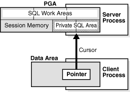

*Schéma : le curseur, pont entre la PGA et la SGA.*

#### 1. L'architecture du pont : 1 Shared ↔ N Private

Imaginez le curseur comme une fiche de lecture personnalisée :

```
  SESSION A (PGA de l'utilisateur 1)       SESSION B (PGA de l'utilisateur 2)
 ┌──────────────────────────────────┐     ┌──────────────────────────────────┐
 │  Curseur Ouvert (Poignée #12)    │     │  Curseur Ouvert (Poignée #99)    │
 │  ┌────────────────────────────┐  │     │  ┌────────────────────────────┐  │
 │  │     PRIVATE SQL AREA       │  │     │  │     PRIVATE SQL AREA       │  │
 │  │  • Valeur : :id = 45       │  │     │  │  • Valeur : :id = 89       │  │
 │  │  • Ligne courante : 15     │  │     │  │  • Ligne courante : 740    │  │
 └──┴──────────────┬─────────────┴──┘     └──┴──────────────┬─────────────┴──┘
                   │                                        │
                   └───────────────┐        ┌───────────────┘
                                   ▼        ▼
                           ┌────────────────────────┐
                           │      LE CURSEUR        │  ◄── Le pont invisible
                           └──────────┬─────────────┘
                                      │
                                      ▼
                        ┌──────────────────────────┐
                        │    SHARED SQL AREA       │ (Dans la SGA :
                        │   (Shared Pool / LC)     │  Library Cache)
                        │ • Texte : WHERE id = :id │
                        │ • Plan d'exécution global│
                        └──────────────────────────┘
```

**Du côté de la PGA (les extrémités privées).** Chaque processus utilisateur ouvre un curseur dans sa PGA. Dans cet espace privé, le système crée une structure qui suit uniquement son travail :

* Le curseur sait quelles données l'utilisateur a injectées (les binds).
* Il contient l'offset (la ligne courante) : l'endroit exact où le pointeur de lecture s'est arrêté.

**Du côté de la SGA (la base commune).** Le curseur traverse la mémoire pour s'ancrer dans le Library Cache de la SGA, sur la Shared SQL Area correspondante. Grâce à ce point d'ancrage, le processus serveur sait exactement quel code exécuter et quel plan suivre, sans relire le disque ni relancer l'optimiseur.

#### 2. Le cycle de vie d'un curseur

1. **OPEN (ouverture) :** le processus serveur alloue l'espace de la Private SQL Area dans la PGA de l'utilisateur. Le pointeur est créé, prêt à l'emploi.
2. **PARSE (analyse) :** le curseur jette son pont vers la SGA. La MMU cherche si la requête existe déjà dans le Library Cache. Oui → Soft Parse, le curseur se lie à la Shared SQL Area existante. Non → Hard Parse, elle est créée.
3. **EXECUTE (exécution) :** l'ALU se met au travail. La requête est lancée avec les variables liées de la PGA et le plan d'exécution de la SGA.
4. **FETCH (extraction) :** l'utilisateur demande des lignes. À chaque paquet renvoyé, le curseur met à jour son état d'avancement interne dans la PGA (ex. « lignes 1 à 100 envoyées »). Tant que le client demande des lignes, le curseur reste ouvert et actif.
5. **CLOSE (fermeture) :** le travail terminé, la zone runtime de la PGA est libérée et le pont coupé. La structure Shared reste dans la SGA au cas où un autre utilisateur en aurait besoin — et le pointeur peut être réutilisé via le Session Cursor Cache, dimensionné par `SESSION_CACHED_CURSORS` (défaut 50, §16).

#### 3. Le résumé ultime de l'architecture mémoire

* La **SGA** permet d'avoir 1 seule copie globale des données (Buffer Cache) et du code (Shared Pool). Elle économise RAM, CPU et I/O, au prix d'une synchronisation par latches et mutexes.
* La **PGA** offre N espaces isolés par processus. Elle élimine les verrous et maximise la vitesse de calcul, mais coûte N fois plus de RAM.
* Le **curseur** est le mécanisme de liaison qui unifie ces deux mondes : l'isolation privée (PGA) s'appuie sur la mutualisation publique (SGA).

### 27. Tableau comparatif SGA vs PGA : 11 critères

| N° | Critère                                                                                                                                            | SGA (Shared Global Area)                                                                              | PGA (Program Global Area)                                                                                 |
| --- | --------------------------------------------------------------------------------------------------------------------------------------------------- | ----------------------------------------------------------------------------------------------------- | --------------------------------------------------------------------------------------------------------- |
| 1   | Portée (scope)                                                                                                                                     | Globale et partagée par tous les processus de l'instance.                                            | Privée et isolée ; propre à un seul processus.                                                         |
| 2   | Nombre dans l'instance                                                                                                                              | Unique (1 seule SGA) par instance.                                                                    | Multiple (N PGA) ; autant que de processus actifs.                                                        |
| 3   | Mécanismes de verrouillage                                                                                                                         | Obligatoires (latches et mutexes) pour éviter la corruption de la structure commune.                 | Aucun (lock-free) ; le processus est seul maître chez lui.                                               |
| 4   | Évolution du coût matériel                                                                                                                       | Fixe et prédictible ; allouée une bonne fois pour toutes au démarrage.                             | Linéaire (O(N)) ; RAM supplémentaire à chaque nouvelle connexion.                                      |
| 5   | Moment d'allocation                                                                                                                                 | Au STARTUP de l'instance (dès l'étape NOMOUNT).                                                     | À la création du processus système (connexion du client).                                              |
| 6   | Volatilité / persistance                                                                                                                           | Disparaît à l'arrêt de l'instance (SHUTDOWN) ou à une panne.                                      | Libérée immédiatement à la déconnexion ou au plantage du client.                                     |
| 7   | Contenu principal                                                                                                                                   | Blocs de données (Buffer Cache), plans SQL et code (Shared Pool), tampons de logs (Redo Log Buffer). | Données de session (Session Memory), bind variables, zones de calcul (Sort / Hash Area).                 |
| 8   | Paramètres clés (Oracle)                                                                                                                          | `SGA_TARGET` (ASMM), `SGA_MAX_SIZE`.                                                              | `PGA_AGGREGATE_TARGET`, `PGA_AGGREGATE_LIMIT`.                                                        |
| 9   | Vues de diagnostic (V$) | `V$SGA`, `V$SGASTAT`, `V$SGA_DYNAMIC_COMPONENTS`. \| `V$PGASTAT`, `V$PROCESS_MEMORY`, `V$SQL_WORKAREA_ACTIVE`. |                                                                                                       |                                                                                                           |
| 10  | Symptômes de sous-dimensionnement                                                                                                                  | Explosions de hard parses (CPU saturé), I/O disque massives, attentes sur latches/mutexes.           | Débordements massifs vers le disque (tablespace TEMP), exécutions Multi-Pass, crashs par manque de RAM. |
| 11  | Techniques d'optimisation OS                                                                                                                        | HugePages (Linux) pour réduire la table des pages du processeur.                                     | Pools de connexions (DRCP / architectures Web) pour casser la croissance linéaire de la RAM.             |

> **À noter :** l'état de session et les raccourcis de curseurs sont des composants de la PGA ; le paramètre `SESSION_CACHED_CURSORS` (défaut 50) dimensionne directement le raccourci curseur côté session (§16, §26). En serveur partagé, la partie « session » de la PGA (l'UGA) migre vers la SGA (Large Pool, sinon Shared Pool) — c'est la seule exception à l'isolation stricte (voir §23).

### 28. RAC et Multitenant : une phrase chacun pour situer

**À retenir :** partager (SGA) contre isoler (PGA) ; on dimensionne séparément.

* **RAC (Real Application Clusters)** : plusieurs instances distinctes (chacune avec sa propre SGA/PGA) tournent sur des serveurs différents mais partagent et synchronisent leurs données en RAM via une interconnexion réseau ultra-rapide (mécanisme de Cache Fusion).
* **Multitenant (CDB/PDB)** : une architecture de consolidation où une seule instance globale (une seule SGA, un pool de processus) gère une base conteneur (CDB) qui héberge plusieurs bases enfichables (PDB) isolées logiquement les unes des autres.

#### La règle d'or ultime : partager contre isoler

```
       ┌────────────────────────────────────────────────────────┐
       │                 LE DILEMME DE L'ARCHITECTURE          │
       ├────────────────────────────────────────┬───────────────┤
       │  PARTAGER (SGA)                        │ ISOLER (PGA)  │
       ├────────────────────────────────────────┼───────────────┤
       │  • Économise la RAM et le CPU          │ • Élimine les │
       │  • Réduit les accès aux disques (I/O)  │   verrous     │
       │  • IMPOSE des verrous (Latches/Mutexes)│ • Vitesse max │
       │                                        │ • COÛTE N x   │
       │                                        │   la RAM      │
       └────────────────────────────────────────┴───────────────┘
```

Comme ces deux philosophies s'opposent mais se complètent, on dimensionne toujours la SGA (`SGA_TARGET`) et la PGA (`PGA_AGGREGATE_TARGET`) séparément : la première selon la taille de vos données chaudes et de votre code, la seconde selon le comportement de vos requêtes (tris, jointures) et le nombre de processus présents sur la scène.

## 6. Surcharge transactionnelle : Undo, Redo, SCN, tablespaces

### 29. Undo vs Redo : annuler ou rejouer

À chaque modification, deux mécanismes de protection travaillent ensemble, avec des rôles opposés :

* **L'undo (l'image « avant »)** : la trace de l'ancienne valeur. Il sert à **annuler** (ROLLBACK), à assurer la **lecture cohérente** des autres sessions (bloc CR) et le multiversion. L'undo n'est pas une structure propre à la RAM : il est stocké sur le disque, dans le **tablespace UNDO**, sous forme de blocs de données comme les autres. Ces blocs undo sont lus et mis en cache dans le Database Buffer Cache exactement comme n'importe quel autre bloc — et, s'ils sont modifiés, ils passent eux aussi par le Redo Log Buffer.
* **Le redo (le « reçu » du changement)** : la trace de *la modification elle-même* — le vecteur de changement (« le compte 10 est passé de 400 à 500 »). Il sert à **rejouer** la transaction après une panne (*roll-forward*). Il naît dans le Redo Log Buffer (SGA) et est vidé par LGWR dans les Redo Log Files (voir §17).

**Résumé :** undo = la photo d'avant (permet d'annuler) ; redo = la note de ce qui a été fait (permet de refaire). Les deux vivent très majoritairement cachés dans la SGA, mais leur « vérité » est sur le disque : l'undo dans le tablespace UNDO, le redo dans les Redo Log Files.

**Règle absolue (Write-Ahead Logging) :** tout bloc modifié — y compris un bloc d'undo — doit d'abord être protégé par un vecteur de redo écrit sur le disque avant d'être définitivement enregistré (§17, §33).

### 30. Le SCN (System Change Number)

* **Définition :** un numéro de séquence universel, incrémenté à chaque modification de la base, qui **ordonne** toutes les transactions de l'instance. C'est l'horloge logique d'Oracle : il permet de savoir « quand » un changement est survenu, même sur une base en cluster.
* **Rôles clés :**
  * **Récupération après crash :** au démarrage, SMON applique le redo jusqu'au dernier SCN cohérent (roll-forward), puis utilise l'undo pour annuler les transactions non commitées (rollback). L'instance retrouve l'état exact du moment de la panne.
  * **Checkpoint :** CKPT enregistre le SCN courant dans les fichiers de contrôle et l'en-tête des datafiles. Tout redo antérieur au SCN du checkpoint n'est plus nécessaire au redémarrage : la base peut jeter les anciens Redo Log Files archivés. C'est pour cela que CKPT « marque l'avancement » (§10).
  * **Lectures cohérentes :** chaque requête travaille à un SCN donné ; tous les utilisateurs voient la même photographie des données, reconstruite à l'aide de l'undo si nécessaire (bloc CR, §14).

> **À retenir :** redo = réjouer en avant jusqu'au SCN du crash ; undo = annuler en arrière les transactions non commitées après ce SCN. Le SCN est ce qui relie ces deux mouvements.

### 31. Tablespaces et tablespace TEMP

* **Tablespace :** le niveau logique entre la base et les fichiers. Un tablespace regroupe un ou plusieurs **datafiles** (sur disque) ; les objets (tables, index) appartiennent à des tablespaces. La base s'appuie sur quelques tablespaces incontournables :
  * `SYSTEM` : le dictionnaire de données.
  * `SYSAUX` : les outils internes (statistiques, etc.).
  * `UNDO` : l'image « avant » (voir §29).
  * `TEMP` : les opérations temporaires.
  * vos tablespaces applicatifs (données, index).
* **Le tablespace TEMP :** dédié aux opérations temporaires — c'est exactement là que débordent les SQL Work Areas de la PGA (§22). En mode One-Pass / Multi-Pass, les « runs » intermédiaires y sont écrits puis relus. Il ne contient jamais de données permanentes : tout y est purgé à la fin de l'opération (et les segments temporaires orphelins sont nettoyés par SMON). Sa taille et son auto-extensibilité sont à surveiller : une TEMP saturée se traduit par des tris interminables ou l'erreur ORA-01652.
* **Même logique de cache :** les blocs undo et temp passent eux aussi par le Buffer Cache de la SGA — ce sont des blocs comme les autres, aux usages particuliers. Un Buffer Cache bien dimensionné profite donc aussi à ces zones « invisibles ».

## 7. Parcours complet

> **Question :** que se passe-t-il vraiment quand on lance la requête ?

### 32. SELECT en 6 étapes : envoi (PGA) -> parse (Shared Pool) -> bind (PGA) -> execute (Buffer Cache) -> fetch (PGA) -> curseur gardé

Voici le parcours chronologique complet d'une requête SQL. Ce voyage montre comment l'ALU, la SGA, la PGA et le curseur collaborent pour transformer une commande textuelle en un flux de données.

```
 [ Application Client ]
          │
          ▼  (1) ENVOI
┌─────────────────────────────────────────────────────────────┐
│ PGA (Mémoire Privée Processus)                              │
│   • Reçoit la requête textuelle                             │
│   • Prépare l'espace du Curseur                             │
└────────┬────────────────────────────────────────────────────┘
         │
         ▼  (2) PARSE (Vers la SGA)
┌─────────────────────────────────────────────────────────────┐
│ SGA -> SHARED POOL (Library Cache + Row Cache)              │
│   • Soft Parse : Plan d'exécution trouvé ! (Latches/Mutexes)│
└────────┬────────────────────────────────────────────────────┘
         │
         ▼  (3) BIND
┌─────────────────────────────────────────────────────────────┐
│ PGA (Mémoire Privée Processus)                              │
│   • Injecte la valeur réelle (:id = 101) dans le curseur    │
└────────┬────────────────────────────────────────────────────┘
         │
         ▼  (4) EXECUTE (Vers la SGA)
┌─────────────────────────────────────────────────────────────┐
│ SGA -> DATABASE BUFFER CACHE                                │
│   • L'ALU traite le plan : lecture des blocs en RAM         │
│   • Si absent : I/O Disque -> Chargement (Point Médian)     │
└────────┬────────────────────────────────────────────────────┘
         │
         ▼  (5) FETCH
┌─────────────────────────────────────────────────────────────┐
│ PGA -> SQL WORK AREAS                                       │
│   • Tri/Filtrage (Optimal / One-Pass)                       │
│   • Renvoi des lignes par paquets au client                 │
└────────┬────────────────────────────────────────────────────┘
         │
         ▼  (6) CURSEUR GARDÉ
┌─────────────────────────────────────────────────────────────┐
│ SESSION CURSOR CACHE                                        │
│   • La structure Runtime est libérée                        │
│   • Le pointeur reste en PGA pour la prochaine fois         │
└─────────────────────────────────────────────────────────────┘
```

* **Étape 1 : l'envoi (PGA).** L'application transmet la chaîne `SELECT * FROM clients WHERE id = :id`. Le processus serveur reçoit ce texte et l'accueille dans sa PGA : il alloue la Private SQL Area et initialise un curseur vide.
* **Étape 2 : le parse (SGA - Shared Pool).** Le processus jette un pont vers la SGA. Il interroge le Library Cache du Shared Pool avec des verrous légers (mutexes), et vérifie les droits et les tables via le Row Cache. Scénario idéal (soft parse) : la requête a déjà été jouée, le curseur privé est associé instantanément à la Shared SQL Area globale contenant le plan.
* **Étape 3 : le bind (PGA).** Le processus revient dans sa PGA, en mode lock-free. Il prend la valeur de l'utilisateur (`:id = 101`) et l'injecte dans la zone persistante de sa Private SQL Area.
* **Étape 4 : l'execute (SGA - Buffer Cache).** L'ALU et le processus serveur exécutent la recette du plan. Ils se dirigent vers le Database Buffer Cache pour lire les blocs contenant le client 101. Présents → lecture à vitesse RAM. Absents → I/O disque lente, bloc chargé en section froide, Touch Count incrémenté.
* **Étape 5 : le fetch (PGA - Work Areas).** Les lignes sont extraites du Buffer Cache et rapatriées dans la PGA. Si la requête exigeait un tri (ORDER BY), l'SQL Work Area s'en charge, entièrement en RAM si l'espace est suffisant (mode optimal). Les lignes sont formatées et renvoyées par paquets sur le réseau.
* **Étape 6 : le curseur gardé (PGA).** La dernière ligne transmise, la zone runtime de la PGA est vidée. Mais le pointeur logique est conservé dans le Session Cursor Cache de la PGA (dimensionné par `SESSION_CACHED_CURSORS`, défaut 50). Si l'application renvoie la même requête quelques millisecondes plus tard, Oracle saute la recherche dans le Shared Pool et réutilise ce raccourci.

**L'enchaînement ultime du partage et de l'isolation.** Ce parcours résume le fonctionnement d'un moteur de base de données : la requête navigue en permanence entre les autoroutes partagées de la SGA (pour mutualiser le code et les blocs) et les salons privés de la PGA (pour traiter les variables et trier les résultats à l'abri de la contention).

### 33. UPDATE et COMMIT : undo, bloc sale, redo, LGWR au COMMIT, DBWn plus tard

**À retenir :** toujours PGA -> SGA -> PGA ; tout hit en RAM évite le disque.

Le parcours asynchrone d'un UPDATE suivi d'un COMMIT montre comment la base garantit la durabilité absolue (ACID) à vitesse matérielle sans être étranglée par les I/O disque. Il est gouverné par le protocole *Write-Ahead Logging* (WAL) et suit un flux strict : **PGA → SGA → PGA**.

```
       [ L'utilisateur lance UPDATE puis COMMIT ]
                      │
                      ▼
┌────────────────────────────────────────────────────────┐
│ 1. PGA (espace de travail privé)                      │
│    • Reçoit l'instruction et les valeurs.             │
└────────────────────┬───────────────────────────────────┘
                     │ (Les pointeurs naviguent vers la SGA)
                     ▼
┌────────────────────────────────────────────────────────┐
│ 2. SGA (espace de travail partagé)                    │
│                                                       │
│    • SEGMENT UNDO   ──► garde l'image « avant ».      │
│    • BUFFER CACHE   ──► modifie le bloc (« sale »).   │
│    • REDO LOG BUFFER──► inscrit le vecteur de change. │
└────────────────────┬───────────────────────────────────┘
                     │ (L'utilisateur tape COMMIT)
                     ▼
┌────────────────────────────────────────────────────────┐
│ 3. PROCESSUS LGWR (flush immédiat)                    │
│    • Vide le Redo Log Buffer ──► REDO LOG FILES (disk)│
└────────────────────┬───────────────────────────────────┘
                     │ (Accusé de réception à l'utilisateur)
                     ▼
┌────────────────────────────────────────────────────────┐
│ 4. PGA (signal de retour)                              │
│    • « Commit Complete » renvoyé, sans verrou.         │
└────────────────────┬───────────────────────────────────┘
                     │ (Quelques minutes plus tard, en asynchrone)
                     ▼
┌────────────────────────────────────────────────────────┐
│ 5. PROCESSUS DBWn (flush paresseux)                    │
│    • Vide les blocs sales ──► DATAFILES (disque)       │
└────────────────────────────────────────────────────────┘
```

* **Étape 1 - la mise en place (PGA) :** le processus utilisateur reçoit la demande (par exemple `UPDATE accounts SET balance = 500 WHERE id = 10`). Tout commence dans la PGA privée : analyse de la requête et isolation des bind variables.
* **Étape 2 - la mutation en RAM (SGA) :** le processus passe dans la SGA pour modifier les données entièrement en mémoire. Aucun fichier du disque n'est encore touché :
  * **Génération d'undo :** l'ancienne valeur (400) est copiée dans un **bloc d'undo — c'est-à-dire un bloc du tablespace UNDO (sur disque), lu et caché dans le Buffer Cache comme n'importe quel bloc**. Cela garantit que les autres utilisateurs voient encore l'ancienne donnée tant que vous n'avez pas commité.
  * **Le bloc sale :** le bloc de données du compte est modifié dans le Database Buffer Cache. Son contenu différant du disque, il est marqué « sale » (dirty).
  * **L'entrée de redo :** un petit vecteur de changement séquentiel (« compte 10 passé de 400 à 500 ») est ajouté au Redo Log Buffer.
* **Étape 3 - le COMMIT et LGWR (frontière du disque) :** l'utilisateur tape COMMIT. LGWR prend le contenu séquentiel du Redo Log Buffer et le **recopie immédiatement dans les Redo Log Files** sur le disque.
* **Étape 4 - retour dans la PGA :** dès que le contrôleur de disque confirme que les entrées de redo sont écrites, la session est libérée. Le message « Commit Complete » est renvoyé dans la PGA de l'utilisateur. La transaction est officiellement durable et irréversible.
* **Étape 5 - DBWn plus tard (Write-Ahead Logging) :** vos tables dans les datafiles contiennent encore l'ancienne donnée — le bloc sale attend dans la RAM du Buffer Cache. Quelques minutes plus tard, ou quand la mémoire manque, DBWn se réveille en arrière-plan et écrit les blocs sales dans les datafiles. Sous la règle WAL, **DBWn a l'interdiction formelle d'écrire un bloc sale tant que LGWR n'a pas écrit son vecteur de redo correspondant**.

**Principe architectural :** toute mutation suit un chemin rigide, PGA → SGA → PGA. En séparant l'écriture séquentielle rapide des changements (LGWR) de l'écriture aléatoire lente des gros blocs de tables (DBWn), la base force le système d'exploitation au débit maximal : tout accès trouvé en RAM évite complètement le disque, pendant que le nettoyage physique est différé à un thread d'arrière-plan tranquille.

## Glossaire

| Terme                                                                                             | Définition                                                                                                                                                                    |
| ------------------------------------------------------------------------------------------------- | ------------------------------------------------------------------------------------------------------------------------------------------------------------------------------ |
| ACID                                                                                              | Atomicité, Cohérence, Isolation, Durabilité — les 4 garanties d'une transaction (le COMMIT scelle la Durabilité).                                                         |
| ALU                                                                                               | *Arithmetic Logic Unit* — l'unité de calcul du processeur.                                                                                                                 |
| ASMM                                                                                              | *Automatic Shared Memory Management* — redimensionnement automatique des pools de la SGA piloté par `SGA_TARGET`.                                                        |
| ASID                                                                                              | *Address Space Identifier* — l'étiquette qui associe chaque ligne du TLB à un processus (méthode moderne de gestion du TLB).                                             |
| Bind variable                                                                                     | Variable liée (`:id`) : permet de réutiliser le même plan SQL pour des valeurs différentes.                                                                              |
| Buffer Cache                                                                                      | Zone de la SGA qui cache les blocs de données lus depuis les datafiles (propre / sale / CR).                                                                                  |
| Bloc CR                                                                                           | *Consistent Read* — copie fantôme d'un bloc reconstruite avec l'undo pour une lecture cohérente.                                                                          |
| Checkpoint (CKPT)                                                                                 | Processus qui demande à DBWn d'écrire les blocs sales et enregistre le SCN dans les fichiers de contrôle et l'en-tête des datafiles. Il n'écrit pas de blocs de données. |
| Datafile                                                                                          | Fichier physique sur disque contenant les données d'un (ou plusieurs) tablespace.                                                                                             |
| DBWn                                                                                              | *Database Writer* — écrit les blocs sales du Buffer Cache vers les datafiles.                                                                                              |
| DRCP                                                                                              | *Database Resident Connection Pool* — pool de processus serveurs dédiés pour les connexions web sans état.                                                               |
| Fixed SGA                                                                                         | Petite zone non modifiable de la SGA : les pointeurs et variables internes de l'instance.                                                                                      |
| Hard parse                                                                                        | Analyse complète d'une nouvelle requête (calcul du plan) : coûteuse en CPU.                                                                                                 |
| HugePages                                                                                         | Grandes pages mémoire (2 Mo ou plus) sous Linux : réduisent la table des pages et suppriment le swapping pour la SGA.                                                        |
| Latch                                                                                             | Verrou interne ultra-léger de la SGA protégeant une structure mémoire entière.                                                                                             |
| Large Pool                                                                                        | Pool de la SGA pour les gros tampons (RMAN, parallélisme, UGA partagée).                                                                                                     |
| LGWR                                                                                              | *Log Writer* — recopie le Redo Log Buffer vers les Redo Log Files (au COMMIT, à 1/3 plein ou 1 Mo, toutes les 3 s, avant DBWn).                                            |
| Library Cache                                                                                     | Zone du Shared Pool qui stocke textes SQL et plans d'exécution (principale source de latches/mutexes).                                                                        |
| MMU                                                                                               | *Memory Management Unit* — traduit adresses virtuelles en adresses physiques (pagination + TLB).                                                                            |
| Mutex                                                                                             | *MUtual EXclusion* — petit verrou encastré dans un objet de la SGA, plus précis et plus rapide qu'un latch.                                                               |
| PGA                                                                                               | *Program Global Area* — mémoire privée d'un processus serveur (lock-free, coût linéaire O(N)).                                                                          |
| PMON                                                                                              | *Process Monitor* — nettoie les sessions mortes ; enregistrait le service auprès du Listener dans les anciennes versions.                                                  |
| Redo Log                                                                                          | Fichiers (sur disque) contenant les vecteurs de changement ; servent au roll-forward après crash.                                                                             |
| Redo Log Buffer                                                                                   | Tampon circulaire de la SGA où les sessions écrivent leurs entrées de redo, vidé par LGWR.                                                                                 |
| Row Cache                                                                                         | *Data Dictionary Cache* — cache en SGA des définitions des tables, colonnes et droits (interrogé lors du parse).                                                          |
| SCN                                                                                               | *System Change Number* — l'horloge logique d'Oracle qui ordonne toutes les transactions.                                                                                    |
| Session Cursor Cache                                                                              | Raccourci PGA vers les curseurs enfants, dimensionné par`SESSION_CACHED_CURSORS` (défaut 50).                                                                              |
| Session Memory                                                                                    | Partie de la PGA qui stocke identité et variables de session (l'UGA si elle est déplacée dans la SGA).                                                                      |
| SGA                                                                                               | *Shared Global Area* — mémoire partagée de l'instance, unique par instance, allouée au STARTUP, volatile.                                                                |
| Shared Pool                                                                                       | Pool de la SGA : Library Cache + Row Cache (le « cerveau » du code SQL).                                                                                                     |
| SMON                                                                                              | *System Monitor* — récupération après crash, coalescence de l'espace libre des tablespaces, nettoyage des segments temporaires.                                          |
| Soft parse                                                                                        | Récupération d'un plan existant dans le Library Cache : très rapide.                                                                                                        |
| SQL Work Area                                                                                     | Zone de calcul de la PGA (tri, hachage, fusion bitmap) : modes optimal / one-pass / multi-pass.                                                                                |
| Tablespace                                                                                        | Regroupement logique de datafiles (SYSTEM, SYSAUX, UNDO, TEMP, applicatifs).                                                                                                   |
| TEMP                                                                                              | Tablespace des opérations temporaires : destination des débordements des SQL Work Areas.                                                                                     |
| TLB                                                                                               | *Translation Lookaside Buffer* — cache des traductions d'adresses de la MMU.                                                                                                |
| UGA                                                                                               | *User Global Area* — l'état de session de l'utilisateur ; dans la PGA (dédié) ou dans la SGA (partagé).                                                                 |
| Undo                                                                                              | L'image « avant » (tablespace UNDO) : permet ROLLBACK et lecture cohérente.                                                                                                 |
| V$ view | Vue de performance dynamique d'Oracle (V$SGA, V$PGASTAT, V$SQL_WORKAREA_ACTIVE...). |                                                                                                                                                                                |
| WAL                                                                                               | *Write-Ahead Logging* — règle : aucun bloc sale écrit avant la mise sur disque de son redo.                                                                               |
| `SGA_TARGET`                                                                                    | Paramètre : taille globale de la SGA, répartie automatiquement par l'ASMM.                                                                                                   |
| `PGA_AGGREGATE_TARGET`                                                                          | Paramètre : cible d'agrégation de la mémoire PGA de l'instance.                                                                                                             |

## Vérification rapide : requêtes de diagnostic (SQL)

Quelques requêtes `V$` pour observer les concepts du guide sur une instance réelle.

### La SGA

```sql
-- Vue d'ensemble : les zones de la SGA et leur taille
SELECT * FROM v$sga;

-- Composants dynamiques (ASMM) : courant / min / max / dernier redimensionnement
SELECT component, current_size, min_size, max_size, last_operation_type, last_operation_time
FROM   v$sga_dynamic_components
WHERE  current_size > 0
ORDER BY current_size DESC;

-- Symptôme de sous-dimensionnement : redimensionnements fréquents (= memory churning)
-- (v$sga_resize_ops = historique des redimensionnements automatiques depuis le démarrage)
SELECT component, operation, count(*) nb_resizes
FROM   v$sga_resize_ops
GROUP BY component, operation
ORDER BY nb_resizes DESC;
```

> Des redimensionnements automatiques nombreux et rapprochés entre Shared Pool et Buffer Cache signalent un `SGA_TARGET` trop faible pour la charge.

### Parsing et Library Cache

```sql
-- Durex parses vs soft parses globaux
SELECT name, value
FROM   v$sysstat
WHERE  name IN ('parse count (total)', 'parse count (hard)', 'session cursor cache hits');

-- Paramètre du raccourci curseur
SELECT name, value FROM v$parameter WHERE name = 'session_cached_cursors';
```

### La PGA et les work areas

```sql
-- Indicateurs clés de la PGA (target, alloué, cache hit des work areas)
SELECT name, value FROM v$pgastat
WHERE  name IN ('aggregate PGA target parameter', 'total PGA allocated', 'cache hit percentage');

-- Opérations lourdes EN COURS (sorts/hachages) et leurs débordements TEMP
SELECT sql_id, operation_type, actual_mem_used, temp_space_allocated, work_area_size
FROM   v$sql_workarea_active;

-- Répartition historique des exécutions optimal / one-pass / multi-pass
SELECT optimal_executions, onepass_executions, multipasses_executions, workarea_size
FROM   v$sql_workarea_histogram
ORDER BY workarea_size;
```

### Les objets de la mémoire

```sql
-- Mémoire totale en cours (SGA + PGA cumulées), par processus
SELECT s.sid, s.username,
       p.spid, p.pga_used_mem, p.pga_alloc_mem, p.pga_freeable_mem, p.pga_max_mem
FROM   v$session s, v$process p
WHERE  s.paddr = p.addr AND s.sid = sys_context('userenv','sid');

-- Segments temporaires actifs (débordements sur le tablespace TEMP)
SELECT tablespace_name, segtype, extents, blocks, seg_blks
FROM   v$tempseg_usage;
```

Ces requêtes vous donnent de quoi vérifier, en direct, chacun des mécanismes décrits dans le guide : taille et composition de la SGA, partage vs isolement, réutilisation des plans, et débordements de la PGA vers le disque.
